# Project ONE
- Course-End Project: Feature Engineering
- Import working directory


```python
#Vey Damneun
import pandas as pd
import numpy as np
import seaborn as sns
import matplotlib.pyplot as plt
%matplotlib inline
# Import label encoder
from sklearn import preprocessing

import os
os.getcwd()

```


    'C:\\Users\\Shark\\ADSPython'


```python
os.listdir(os.getcwd())
```


    ['.ipynb_checkpoints',
     '7.01_Feature_Selection.ipynb',
     'Applied Data Science With Python (1).ipynb',
     'Applied Data Science With Python Day5.ipynb',
     'Applied Data Science With Python.ipynb',
     'Data',
     'Project1.ipynb',
     'Project2.ipynb']


## Load file using relative path


```python
from os import getcwd, chdir
```

# Perform the following steps:
### 1.	Understand the dataset:
- a.	Identify the shape of the dataset
- b.	Identify variables with null values
- c.	Identify variables with unique values
### 2.	Generate a separate dataset for numerical and categorical variables
### 3.	EDA of numerical variables:
- a.	Missing value treatment
- b.	Identify the skewness and distribution
- c.	Identify significant variables using a correlation matrix 
- d.	Pair plot for distribution and density
### 4 .	EDA of categorical variables
- a.	Missing value treatment
- b.	Count plot and box plot for bivariate analysis
- c.	Identify significant variables using p-values and Chi-Square values
### 5.	Combine all the significant categorical and numerical variables
### 6.	Plot box plot for the new dataset to find the variables with outliers


### 1.	Understand the dataset:


```python
proj1 = pd.read_csv('C:\\Users\\Shark\\ADSPython\\Data\PEP1.csv')
proj1
```


<div>
<style scoped>
    .dataframe tbody tr th:only-of-type {
        vertical-align: middle;
    }

    .dataframe tbody tr th {
        vertical-align: top;
    }

    .dataframe thead th {
        text-align: right;
    }
</style>
<table border="1" class="dataframe">
  <thead>
    <tr style="text-align: right;">
      <th></th>
      <th>Id</th>
      <th>MSSubClass</th>
      <th>MSZoning</th>
      <th>LotFrontage</th>
      <th>LotArea</th>
      <th>Street</th>
      <th>Alley</th>
      <th>LotShape</th>
      <th>LandContour</th>
      <th>Utilities</th>
      <th>...</th>
      <th>PoolArea</th>
      <th>PoolQC</th>
      <th>Fence</th>
      <th>MiscFeature</th>
      <th>MiscVal</th>
      <th>MoSold</th>
      <th>YrSold</th>
      <th>SaleType</th>
      <th>SaleCondition</th>
      <th>SalePrice</th>
    </tr>
  </thead>
  <tbody>
    <tr>
      <th>0</th>
      <td>1</td>
      <td>60</td>
      <td>RL</td>
      <td>65.0</td>
      <td>8450</td>
      <td>Pave</td>
      <td>NaN</td>
      <td>Reg</td>
      <td>Lvl</td>
      <td>AllPub</td>
      <td>...</td>
      <td>0</td>
      <td>NaN</td>
      <td>NaN</td>
      <td>NaN</td>
      <td>0</td>
      <td>2</td>
      <td>2008</td>
      <td>WD</td>
      <td>Normal</td>
      <td>208500</td>
    </tr>
    <tr>
      <th>1</th>
      <td>2</td>
      <td>20</td>
      <td>RL</td>
      <td>80.0</td>
      <td>9600</td>
      <td>Pave</td>
      <td>NaN</td>
      <td>Reg</td>
      <td>Lvl</td>
      <td>AllPub</td>
      <td>...</td>
      <td>0</td>
      <td>NaN</td>
      <td>NaN</td>
      <td>NaN</td>
      <td>0</td>
      <td>5</td>
      <td>2007</td>
      <td>WD</td>
      <td>Normal</td>
      <td>181500</td>
    </tr>
    <tr>
      <th>2</th>
      <td>3</td>
      <td>60</td>
      <td>RL</td>
      <td>68.0</td>
      <td>11250</td>
      <td>Pave</td>
      <td>NaN</td>
      <td>IR1</td>
      <td>Lvl</td>
      <td>AllPub</td>
      <td>...</td>
      <td>0</td>
      <td>NaN</td>
      <td>NaN</td>
      <td>NaN</td>
      <td>0</td>
      <td>9</td>
      <td>2008</td>
      <td>WD</td>
      <td>Normal</td>
      <td>223500</td>
    </tr>
    <tr>
      <th>3</th>
      <td>4</td>
      <td>70</td>
      <td>RL</td>
      <td>60.0</td>
      <td>9550</td>
      <td>Pave</td>
      <td>NaN</td>
      <td>IR1</td>
      <td>Lvl</td>
      <td>AllPub</td>
      <td>...</td>
      <td>0</td>
      <td>NaN</td>
      <td>NaN</td>
      <td>NaN</td>
      <td>0</td>
      <td>2</td>
      <td>2006</td>
      <td>WD</td>
      <td>Abnorml</td>
      <td>140000</td>
    </tr>
    <tr>
      <th>4</th>
      <td>5</td>
      <td>60</td>
      <td>RL</td>
      <td>84.0</td>
      <td>14260</td>
      <td>Pave</td>
      <td>NaN</td>
      <td>IR1</td>
      <td>Lvl</td>
      <td>AllPub</td>
      <td>...</td>
      <td>0</td>
      <td>NaN</td>
      <td>NaN</td>
      <td>NaN</td>
      <td>0</td>
      <td>12</td>
      <td>2008</td>
      <td>WD</td>
      <td>Normal</td>
      <td>250000</td>
    </tr>
    <tr>
      <th>...</th>
      <td>...</td>
      <td>...</td>
      <td>...</td>
      <td>...</td>
      <td>...</td>
      <td>...</td>
      <td>...</td>
      <td>...</td>
      <td>...</td>
      <td>...</td>
      <td>...</td>
      <td>...</td>
      <td>...</td>
      <td>...</td>
      <td>...</td>
      <td>...</td>
      <td>...</td>
      <td>...</td>
      <td>...</td>
      <td>...</td>
      <td>...</td>
    </tr>
    <tr>
      <th>1455</th>
      <td>1456</td>
      <td>60</td>
      <td>RL</td>
      <td>62.0</td>
      <td>7917</td>
      <td>Pave</td>
      <td>NaN</td>
      <td>Reg</td>
      <td>Lvl</td>
      <td>AllPub</td>
      <td>...</td>
      <td>0</td>
      <td>NaN</td>
      <td>NaN</td>
      <td>NaN</td>
      <td>0</td>
      <td>8</td>
      <td>2007</td>
      <td>WD</td>
      <td>Normal</td>
      <td>175000</td>
    </tr>
    <tr>
      <th>1456</th>
      <td>1457</td>
      <td>20</td>
      <td>RL</td>
      <td>85.0</td>
      <td>13175</td>
      <td>Pave</td>
      <td>NaN</td>
      <td>Reg</td>
      <td>Lvl</td>
      <td>AllPub</td>
      <td>...</td>
      <td>0</td>
      <td>NaN</td>
      <td>MnPrv</td>
      <td>NaN</td>
      <td>0</td>
      <td>2</td>
      <td>2010</td>
      <td>WD</td>
      <td>Normal</td>
      <td>210000</td>
    </tr>
    <tr>
      <th>1457</th>
      <td>1458</td>
      <td>70</td>
      <td>RL</td>
      <td>66.0</td>
      <td>9042</td>
      <td>Pave</td>
      <td>NaN</td>
      <td>Reg</td>
      <td>Lvl</td>
      <td>AllPub</td>
      <td>...</td>
      <td>0</td>
      <td>NaN</td>
      <td>GdPrv</td>
      <td>Shed</td>
      <td>2500</td>
      <td>5</td>
      <td>2010</td>
      <td>WD</td>
      <td>Normal</td>
      <td>266500</td>
    </tr>
    <tr>
      <th>1458</th>
      <td>1459</td>
      <td>20</td>
      <td>RL</td>
      <td>68.0</td>
      <td>9717</td>
      <td>Pave</td>
      <td>NaN</td>
      <td>Reg</td>
      <td>Lvl</td>
      <td>AllPub</td>
      <td>...</td>
      <td>0</td>
      <td>NaN</td>
      <td>NaN</td>
      <td>NaN</td>
      <td>0</td>
      <td>4</td>
      <td>2010</td>
      <td>WD</td>
      <td>Normal</td>
      <td>142125</td>
    </tr>
    <tr>
      <th>1459</th>
      <td>1460</td>
      <td>20</td>
      <td>RL</td>
      <td>75.0</td>
      <td>9937</td>
      <td>Pave</td>
      <td>NaN</td>
      <td>Reg</td>
      <td>Lvl</td>
      <td>AllPub</td>
      <td>...</td>
      <td>0</td>
      <td>NaN</td>
      <td>NaN</td>
      <td>NaN</td>
      <td>0</td>
      <td>6</td>
      <td>2008</td>
      <td>WD</td>
      <td>Normal</td>
      <td>147500</td>
    </tr>
  </tbody>
</table>
<p>1460 rows × 81 columns</p>
</div>


```python
proj1.head(5)
```


<div>
<style scoped>
    .dataframe tbody tr th:only-of-type {
        vertical-align: middle;
    }

    .dataframe tbody tr th {
        vertical-align: top;
    }

    .dataframe thead th {
        text-align: right;
    }
</style>
<table border="1" class="dataframe">
  <thead>
    <tr style="text-align: right;">
      <th></th>
      <th>Id</th>
      <th>MSSubClass</th>
      <th>MSZoning</th>
      <th>LotFrontage</th>
      <th>LotArea</th>
      <th>Street</th>
      <th>Alley</th>
      <th>LotShape</th>
      <th>LandContour</th>
      <th>Utilities</th>
      <th>...</th>
      <th>PoolArea</th>
      <th>PoolQC</th>
      <th>Fence</th>
      <th>MiscFeature</th>
      <th>MiscVal</th>
      <th>MoSold</th>
      <th>YrSold</th>
      <th>SaleType</th>
      <th>SaleCondition</th>
      <th>SalePrice</th>
    </tr>
  </thead>
  <tbody>
    <tr>
      <th>0</th>
      <td>1</td>
      <td>60</td>
      <td>RL</td>
      <td>65.0</td>
      <td>8450</td>
      <td>Pave</td>
      <td>NaN</td>
      <td>Reg</td>
      <td>Lvl</td>
      <td>AllPub</td>
      <td>...</td>
      <td>0</td>
      <td>NaN</td>
      <td>NaN</td>
      <td>NaN</td>
      <td>0</td>
      <td>2</td>
      <td>2008</td>
      <td>WD</td>
      <td>Normal</td>
      <td>208500</td>
    </tr>
    <tr>
      <th>1</th>
      <td>2</td>
      <td>20</td>
      <td>RL</td>
      <td>80.0</td>
      <td>9600</td>
      <td>Pave</td>
      <td>NaN</td>
      <td>Reg</td>
      <td>Lvl</td>
      <td>AllPub</td>
      <td>...</td>
      <td>0</td>
      <td>NaN</td>
      <td>NaN</td>
      <td>NaN</td>
      <td>0</td>
      <td>5</td>
      <td>2007</td>
      <td>WD</td>
      <td>Normal</td>
      <td>181500</td>
    </tr>
    <tr>
      <th>2</th>
      <td>3</td>
      <td>60</td>
      <td>RL</td>
      <td>68.0</td>
      <td>11250</td>
      <td>Pave</td>
      <td>NaN</td>
      <td>IR1</td>
      <td>Lvl</td>
      <td>AllPub</td>
      <td>...</td>
      <td>0</td>
      <td>NaN</td>
      <td>NaN</td>
      <td>NaN</td>
      <td>0</td>
      <td>9</td>
      <td>2008</td>
      <td>WD</td>
      <td>Normal</td>
      <td>223500</td>
    </tr>
    <tr>
      <th>3</th>
      <td>4</td>
      <td>70</td>
      <td>RL</td>
      <td>60.0</td>
      <td>9550</td>
      <td>Pave</td>
      <td>NaN</td>
      <td>IR1</td>
      <td>Lvl</td>
      <td>AllPub</td>
      <td>...</td>
      <td>0</td>
      <td>NaN</td>
      <td>NaN</td>
      <td>NaN</td>
      <td>0</td>
      <td>2</td>
      <td>2006</td>
      <td>WD</td>
      <td>Abnorml</td>
      <td>140000</td>
    </tr>
    <tr>
      <th>4</th>
      <td>5</td>
      <td>60</td>
      <td>RL</td>
      <td>84.0</td>
      <td>14260</td>
      <td>Pave</td>
      <td>NaN</td>
      <td>IR1</td>
      <td>Lvl</td>
      <td>AllPub</td>
      <td>...</td>
      <td>0</td>
      <td>NaN</td>
      <td>NaN</td>
      <td>NaN</td>
      <td>0</td>
      <td>12</td>
      <td>2008</td>
      <td>WD</td>
      <td>Normal</td>
      <td>250000</td>
    </tr>
  </tbody>
</table>
<p>5 rows × 81 columns</p>
</div>


```python
proj1.describe()
```


<div>
<style scoped>
    .dataframe tbody tr th:only-of-type {
        vertical-align: middle;
    }

    .dataframe tbody tr th {
        vertical-align: top;
    }

    .dataframe thead th {
        text-align: right;
    }
</style>
<table border="1" class="dataframe">
  <thead>
    <tr style="text-align: right;">
      <th></th>
      <th>Id</th>
      <th>MSSubClass</th>
      <th>LotFrontage</th>
      <th>LotArea</th>
      <th>OverallQual</th>
      <th>OverallCond</th>
      <th>YearBuilt</th>
      <th>YearRemodAdd</th>
      <th>MasVnrArea</th>
      <th>BsmtFinSF1</th>
      <th>...</th>
      <th>WoodDeckSF</th>
      <th>OpenPorchSF</th>
      <th>EnclosedPorch</th>
      <th>3SsnPorch</th>
      <th>ScreenPorch</th>
      <th>PoolArea</th>
      <th>MiscVal</th>
      <th>MoSold</th>
      <th>YrSold</th>
      <th>SalePrice</th>
    </tr>
  </thead>
  <tbody>
    <tr>
      <th>count</th>
      <td>1460.000000</td>
      <td>1460.000000</td>
      <td>1201.000000</td>
      <td>1460.000000</td>
      <td>1460.000000</td>
      <td>1460.000000</td>
      <td>1460.000000</td>
      <td>1460.000000</td>
      <td>1452.000000</td>
      <td>1460.000000</td>
      <td>...</td>
      <td>1460.000000</td>
      <td>1460.000000</td>
      <td>1460.000000</td>
      <td>1460.000000</td>
      <td>1460.000000</td>
      <td>1460.000000</td>
      <td>1460.000000</td>
      <td>1460.000000</td>
      <td>1460.000000</td>
      <td>1460.000000</td>
    </tr>
    <tr>
      <th>mean</th>
      <td>730.500000</td>
      <td>56.897260</td>
      <td>70.049958</td>
      <td>10516.828082</td>
      <td>6.099315</td>
      <td>5.575342</td>
      <td>1971.267808</td>
      <td>1984.865753</td>
      <td>103.685262</td>
      <td>443.639726</td>
      <td>...</td>
      <td>94.244521</td>
      <td>46.660274</td>
      <td>21.954110</td>
      <td>3.409589</td>
      <td>15.060959</td>
      <td>2.758904</td>
      <td>43.489041</td>
      <td>6.321918</td>
      <td>2007.815753</td>
      <td>180921.195890</td>
    </tr>
    <tr>
      <th>std</th>
      <td>421.610009</td>
      <td>42.300571</td>
      <td>24.284752</td>
      <td>9981.264932</td>
      <td>1.382997</td>
      <td>1.112799</td>
      <td>30.202904</td>
      <td>20.645407</td>
      <td>181.066207</td>
      <td>456.098091</td>
      <td>...</td>
      <td>125.338794</td>
      <td>66.256028</td>
      <td>61.119149</td>
      <td>29.317331</td>
      <td>55.757415</td>
      <td>40.177307</td>
      <td>496.123024</td>
      <td>2.703626</td>
      <td>1.328095</td>
      <td>79442.502883</td>
    </tr>
    <tr>
      <th>min</th>
      <td>1.000000</td>
      <td>20.000000</td>
      <td>21.000000</td>
      <td>1300.000000</td>
      <td>1.000000</td>
      <td>1.000000</td>
      <td>1872.000000</td>
      <td>1950.000000</td>
      <td>0.000000</td>
      <td>0.000000</td>
      <td>...</td>
      <td>0.000000</td>
      <td>0.000000</td>
      <td>0.000000</td>
      <td>0.000000</td>
      <td>0.000000</td>
      <td>0.000000</td>
      <td>0.000000</td>
      <td>1.000000</td>
      <td>2006.000000</td>
      <td>34900.000000</td>
    </tr>
    <tr>
      <th>25%</th>
      <td>365.750000</td>
      <td>20.000000</td>
      <td>59.000000</td>
      <td>7553.500000</td>
      <td>5.000000</td>
      <td>5.000000</td>
      <td>1954.000000</td>
      <td>1967.000000</td>
      <td>0.000000</td>
      <td>0.000000</td>
      <td>...</td>
      <td>0.000000</td>
      <td>0.000000</td>
      <td>0.000000</td>
      <td>0.000000</td>
      <td>0.000000</td>
      <td>0.000000</td>
      <td>0.000000</td>
      <td>5.000000</td>
      <td>2007.000000</td>
      <td>129975.000000</td>
    </tr>
    <tr>
      <th>50%</th>
      <td>730.500000</td>
      <td>50.000000</td>
      <td>69.000000</td>
      <td>9478.500000</td>
      <td>6.000000</td>
      <td>5.000000</td>
      <td>1973.000000</td>
      <td>1994.000000</td>
      <td>0.000000</td>
      <td>383.500000</td>
      <td>...</td>
      <td>0.000000</td>
      <td>25.000000</td>
      <td>0.000000</td>
      <td>0.000000</td>
      <td>0.000000</td>
      <td>0.000000</td>
      <td>0.000000</td>
      <td>6.000000</td>
      <td>2008.000000</td>
      <td>163000.000000</td>
    </tr>
    <tr>
      <th>75%</th>
      <td>1095.250000</td>
      <td>70.000000</td>
      <td>80.000000</td>
      <td>11601.500000</td>
      <td>7.000000</td>
      <td>6.000000</td>
      <td>2000.000000</td>
      <td>2004.000000</td>
      <td>166.000000</td>
      <td>712.250000</td>
      <td>...</td>
      <td>168.000000</td>
      <td>68.000000</td>
      <td>0.000000</td>
      <td>0.000000</td>
      <td>0.000000</td>
      <td>0.000000</td>
      <td>0.000000</td>
      <td>8.000000</td>
      <td>2009.000000</td>
      <td>214000.000000</td>
    </tr>
    <tr>
      <th>max</th>
      <td>1460.000000</td>
      <td>190.000000</td>
      <td>313.000000</td>
      <td>215245.000000</td>
      <td>10.000000</td>
      <td>9.000000</td>
      <td>2010.000000</td>
      <td>2010.000000</td>
      <td>1600.000000</td>
      <td>5644.000000</td>
      <td>...</td>
      <td>857.000000</td>
      <td>547.000000</td>
      <td>552.000000</td>
      <td>508.000000</td>
      <td>480.000000</td>
      <td>738.000000</td>
      <td>15500.000000</td>
      <td>12.000000</td>
      <td>2010.000000</td>
      <td>755000.000000</td>
    </tr>
  </tbody>
</table>
<p>8 rows × 38 columns</p>
</div>


```python
proj1.columns
```


    Index(['Id', 'MSSubClass', 'MSZoning', 'LotFrontage', 'LotArea', 'Street',
           'Alley', 'LotShape', 'LandContour', 'Utilities', 'LotConfig',
           'LandSlope', 'Neighborhood', 'Condition1', 'Condition2', 'BldgType',
           'HouseStyle', 'OverallQual', 'OverallCond', 'YearBuilt', 'YearRemodAdd',
           'RoofStyle', 'RoofMatl', 'Exterior1st', 'Exterior2nd', 'MasVnrType',
           'MasVnrArea', 'ExterQual', 'ExterCond', 'Foundation', 'BsmtQual',
           'BsmtCond', 'BsmtExposure', 'BsmtFinType1', 'BsmtFinSF1',
           'BsmtFinType2', 'BsmtFinSF2', 'BsmtUnfSF', 'TotalBsmtSF', 'Heating',
           'HeatingQC', 'CentralAir', 'Electrical', '1stFlrSF', '2ndFlrSF',
           'LowQualFinSF', 'GrLivArea', 'BsmtFullBath', 'BsmtHalfBath', 'FullBath',
           'HalfBath', 'BedroomAbvGr', 'KitchebvGr', 'KitchenQual', 'TotRmsAbvGrd',
           'Functiol', 'Fireplaces', 'FireplaceQu', 'GarageType', 'GarageYrBlt',
           'GarageFinish', 'GarageCars', 'GarageArea', 'GarageQual', 'GarageCond',
           'PavedDrive', 'WoodDeckSF', 'OpenPorchSF', 'EnclosedPorch', '3SsnPorch',
           'ScreenPorch', 'PoolArea', 'PoolQC', 'Fence', 'MiscFeature', 'MiscVal',
           'MoSold', 'YrSold', 'SaleType', 'SaleCondition', 'SalePrice'],
          dtype='object')


```python
proj1.dtypes
```


    Id                 int64
    MSSubClass         int64
    MSZoning          object
    LotFrontage      float64
    LotArea            int64
                      ...   
    MoSold             int64
    YrSold             int64
    SaleType          object
    SaleCondition     object
    SalePrice          int64
    Length: 81, dtype: object


### a.	Identify the shape of the dataset


```python
proj1.shape
```


    (1460, 81)


### b.	Identify variables with null values


```python
proj1.isna()
```


<div>
<style scoped>
    .dataframe tbody tr th:only-of-type {
        vertical-align: middle;
    }

    .dataframe tbody tr th {
        vertical-align: top;
    }

    .dataframe thead th {
        text-align: right;
    }
</style>
<table border="1" class="dataframe">
  <thead>
    <tr style="text-align: right;">
      <th></th>
      <th>Id</th>
      <th>MSSubClass</th>
      <th>MSZoning</th>
      <th>LotFrontage</th>
      <th>LotArea</th>
      <th>Street</th>
      <th>Alley</th>
      <th>LotShape</th>
      <th>LandContour</th>
      <th>Utilities</th>
      <th>...</th>
      <th>PoolArea</th>
      <th>PoolQC</th>
      <th>Fence</th>
      <th>MiscFeature</th>
      <th>MiscVal</th>
      <th>MoSold</th>
      <th>YrSold</th>
      <th>SaleType</th>
      <th>SaleCondition</th>
      <th>SalePrice</th>
    </tr>
  </thead>
  <tbody>
    <tr>
      <th>0</th>
      <td>False</td>
      <td>False</td>
      <td>False</td>
      <td>False</td>
      <td>False</td>
      <td>False</td>
      <td>True</td>
      <td>False</td>
      <td>False</td>
      <td>False</td>
      <td>...</td>
      <td>False</td>
      <td>True</td>
      <td>True</td>
      <td>True</td>
      <td>False</td>
      <td>False</td>
      <td>False</td>
      <td>False</td>
      <td>False</td>
      <td>False</td>
    </tr>
    <tr>
      <th>1</th>
      <td>False</td>
      <td>False</td>
      <td>False</td>
      <td>False</td>
      <td>False</td>
      <td>False</td>
      <td>True</td>
      <td>False</td>
      <td>False</td>
      <td>False</td>
      <td>...</td>
      <td>False</td>
      <td>True</td>
      <td>True</td>
      <td>True</td>
      <td>False</td>
      <td>False</td>
      <td>False</td>
      <td>False</td>
      <td>False</td>
      <td>False</td>
    </tr>
    <tr>
      <th>2</th>
      <td>False</td>
      <td>False</td>
      <td>False</td>
      <td>False</td>
      <td>False</td>
      <td>False</td>
      <td>True</td>
      <td>False</td>
      <td>False</td>
      <td>False</td>
      <td>...</td>
      <td>False</td>
      <td>True</td>
      <td>True</td>
      <td>True</td>
      <td>False</td>
      <td>False</td>
      <td>False</td>
      <td>False</td>
      <td>False</td>
      <td>False</td>
    </tr>
    <tr>
      <th>3</th>
      <td>False</td>
      <td>False</td>
      <td>False</td>
      <td>False</td>
      <td>False</td>
      <td>False</td>
      <td>True</td>
      <td>False</td>
      <td>False</td>
      <td>False</td>
      <td>...</td>
      <td>False</td>
      <td>True</td>
      <td>True</td>
      <td>True</td>
      <td>False</td>
      <td>False</td>
      <td>False</td>
      <td>False</td>
      <td>False</td>
      <td>False</td>
    </tr>
    <tr>
      <th>4</th>
      <td>False</td>
      <td>False</td>
      <td>False</td>
      <td>False</td>
      <td>False</td>
      <td>False</td>
      <td>True</td>
      <td>False</td>
      <td>False</td>
      <td>False</td>
      <td>...</td>
      <td>False</td>
      <td>True</td>
      <td>True</td>
      <td>True</td>
      <td>False</td>
      <td>False</td>
      <td>False</td>
      <td>False</td>
      <td>False</td>
      <td>False</td>
    </tr>
    <tr>
      <th>...</th>
      <td>...</td>
      <td>...</td>
      <td>...</td>
      <td>...</td>
      <td>...</td>
      <td>...</td>
      <td>...</td>
      <td>...</td>
      <td>...</td>
      <td>...</td>
      <td>...</td>
      <td>...</td>
      <td>...</td>
      <td>...</td>
      <td>...</td>
      <td>...</td>
      <td>...</td>
      <td>...</td>
      <td>...</td>
      <td>...</td>
      <td>...</td>
    </tr>
    <tr>
      <th>1455</th>
      <td>False</td>
      <td>False</td>
      <td>False</td>
      <td>False</td>
      <td>False</td>
      <td>False</td>
      <td>True</td>
      <td>False</td>
      <td>False</td>
      <td>False</td>
      <td>...</td>
      <td>False</td>
      <td>True</td>
      <td>True</td>
      <td>True</td>
      <td>False</td>
      <td>False</td>
      <td>False</td>
      <td>False</td>
      <td>False</td>
      <td>False</td>
    </tr>
    <tr>
      <th>1456</th>
      <td>False</td>
      <td>False</td>
      <td>False</td>
      <td>False</td>
      <td>False</td>
      <td>False</td>
      <td>True</td>
      <td>False</td>
      <td>False</td>
      <td>False</td>
      <td>...</td>
      <td>False</td>
      <td>True</td>
      <td>False</td>
      <td>True</td>
      <td>False</td>
      <td>False</td>
      <td>False</td>
      <td>False</td>
      <td>False</td>
      <td>False</td>
    </tr>
    <tr>
      <th>1457</th>
      <td>False</td>
      <td>False</td>
      <td>False</td>
      <td>False</td>
      <td>False</td>
      <td>False</td>
      <td>True</td>
      <td>False</td>
      <td>False</td>
      <td>False</td>
      <td>...</td>
      <td>False</td>
      <td>True</td>
      <td>False</td>
      <td>False</td>
      <td>False</td>
      <td>False</td>
      <td>False</td>
      <td>False</td>
      <td>False</td>
      <td>False</td>
    </tr>
    <tr>
      <th>1458</th>
      <td>False</td>
      <td>False</td>
      <td>False</td>
      <td>False</td>
      <td>False</td>
      <td>False</td>
      <td>True</td>
      <td>False</td>
      <td>False</td>
      <td>False</td>
      <td>...</td>
      <td>False</td>
      <td>True</td>
      <td>True</td>
      <td>True</td>
      <td>False</td>
      <td>False</td>
      <td>False</td>
      <td>False</td>
      <td>False</td>
      <td>False</td>
    </tr>
    <tr>
      <th>1459</th>
      <td>False</td>
      <td>False</td>
      <td>False</td>
      <td>False</td>
      <td>False</td>
      <td>False</td>
      <td>True</td>
      <td>False</td>
      <td>False</td>
      <td>False</td>
      <td>...</td>
      <td>False</td>
      <td>True</td>
      <td>True</td>
      <td>True</td>
      <td>False</td>
      <td>False</td>
      <td>False</td>
      <td>False</td>
      <td>False</td>
      <td>False</td>
    </tr>
  </tbody>
</table>
<p>1460 rows × 81 columns</p>
</div>


```python
#finding missing values
proj1.isna().any()
```


    Id               False
    MSSubClass       False
    MSZoning         False
    LotFrontage       True
    LotArea          False
                     ...  
    MoSold           False
    YrSold           False
    SaleType         False
    SaleCondition    False
    SalePrice        False
    Length: 81, dtype: bool


```python
proj1.isna().sum()
```


    Id                 0
    MSSubClass         0
    MSZoning           0
    LotFrontage      259
    LotArea            0
                    ... 
    MoSold             0
    YrSold             0
    SaleType           0
    SaleCondition      0
    SalePrice          0
    Length: 81, dtype: int64


```python
proj1.count()
```


    Id               1460
    MSSubClass       1460
    MSZoning         1460
    LotFrontage      1201
    LotArea          1460
                     ... 
    MoSold           1460
    YrSold           1460
    SaleType         1460
    SaleCondition    1460
    SalePrice        1460
    Length: 81, dtype: int64


```python
# what % missing value in each column why import to delte or make changes
proj1.isna().sum()*100/ proj1.shape[0]
```


    Id                0.000000
    MSSubClass        0.000000
    MSZoning          0.000000
    LotFrontage      17.739726
    LotArea           0.000000
                       ...    
    MoSold            0.000000
    YrSold            0.000000
    SaleType          0.000000
    SaleCondition     0.000000
    SalePrice         0.000000
    Length: 81, dtype: float64


```python
proj1.drop_duplicates()
```


<div>
<style scoped>
    .dataframe tbody tr th:only-of-type {
        vertical-align: middle;
    }

    .dataframe tbody tr th {
        vertical-align: top;
    }

    .dataframe thead th {
        text-align: right;
    }
</style>
<table border="1" class="dataframe">
  <thead>
    <tr style="text-align: right;">
      <th></th>
      <th>Id</th>
      <th>MSSubClass</th>
      <th>MSZoning</th>
      <th>LotFrontage</th>
      <th>LotArea</th>
      <th>Street</th>
      <th>Alley</th>
      <th>LotShape</th>
      <th>LandContour</th>
      <th>Utilities</th>
      <th>...</th>
      <th>PoolArea</th>
      <th>PoolQC</th>
      <th>Fence</th>
      <th>MiscFeature</th>
      <th>MiscVal</th>
      <th>MoSold</th>
      <th>YrSold</th>
      <th>SaleType</th>
      <th>SaleCondition</th>
      <th>SalePrice</th>
    </tr>
  </thead>
  <tbody>
    <tr>
      <th>0</th>
      <td>1</td>
      <td>60</td>
      <td>RL</td>
      <td>65.0</td>
      <td>8450</td>
      <td>Pave</td>
      <td>NaN</td>
      <td>Reg</td>
      <td>Lvl</td>
      <td>AllPub</td>
      <td>...</td>
      <td>0</td>
      <td>NaN</td>
      <td>NaN</td>
      <td>NaN</td>
      <td>0</td>
      <td>2</td>
      <td>2008</td>
      <td>WD</td>
      <td>Normal</td>
      <td>208500</td>
    </tr>
    <tr>
      <th>1</th>
      <td>2</td>
      <td>20</td>
      <td>RL</td>
      <td>80.0</td>
      <td>9600</td>
      <td>Pave</td>
      <td>NaN</td>
      <td>Reg</td>
      <td>Lvl</td>
      <td>AllPub</td>
      <td>...</td>
      <td>0</td>
      <td>NaN</td>
      <td>NaN</td>
      <td>NaN</td>
      <td>0</td>
      <td>5</td>
      <td>2007</td>
      <td>WD</td>
      <td>Normal</td>
      <td>181500</td>
    </tr>
    <tr>
      <th>2</th>
      <td>3</td>
      <td>60</td>
      <td>RL</td>
      <td>68.0</td>
      <td>11250</td>
      <td>Pave</td>
      <td>NaN</td>
      <td>IR1</td>
      <td>Lvl</td>
      <td>AllPub</td>
      <td>...</td>
      <td>0</td>
      <td>NaN</td>
      <td>NaN</td>
      <td>NaN</td>
      <td>0</td>
      <td>9</td>
      <td>2008</td>
      <td>WD</td>
      <td>Normal</td>
      <td>223500</td>
    </tr>
    <tr>
      <th>3</th>
      <td>4</td>
      <td>70</td>
      <td>RL</td>
      <td>60.0</td>
      <td>9550</td>
      <td>Pave</td>
      <td>NaN</td>
      <td>IR1</td>
      <td>Lvl</td>
      <td>AllPub</td>
      <td>...</td>
      <td>0</td>
      <td>NaN</td>
      <td>NaN</td>
      <td>NaN</td>
      <td>0</td>
      <td>2</td>
      <td>2006</td>
      <td>WD</td>
      <td>Abnorml</td>
      <td>140000</td>
    </tr>
    <tr>
      <th>4</th>
      <td>5</td>
      <td>60</td>
      <td>RL</td>
      <td>84.0</td>
      <td>14260</td>
      <td>Pave</td>
      <td>NaN</td>
      <td>IR1</td>
      <td>Lvl</td>
      <td>AllPub</td>
      <td>...</td>
      <td>0</td>
      <td>NaN</td>
      <td>NaN</td>
      <td>NaN</td>
      <td>0</td>
      <td>12</td>
      <td>2008</td>
      <td>WD</td>
      <td>Normal</td>
      <td>250000</td>
    </tr>
    <tr>
      <th>...</th>
      <td>...</td>
      <td>...</td>
      <td>...</td>
      <td>...</td>
      <td>...</td>
      <td>...</td>
      <td>...</td>
      <td>...</td>
      <td>...</td>
      <td>...</td>
      <td>...</td>
      <td>...</td>
      <td>...</td>
      <td>...</td>
      <td>...</td>
      <td>...</td>
      <td>...</td>
      <td>...</td>
      <td>...</td>
      <td>...</td>
      <td>...</td>
    </tr>
    <tr>
      <th>1455</th>
      <td>1456</td>
      <td>60</td>
      <td>RL</td>
      <td>62.0</td>
      <td>7917</td>
      <td>Pave</td>
      <td>NaN</td>
      <td>Reg</td>
      <td>Lvl</td>
      <td>AllPub</td>
      <td>...</td>
      <td>0</td>
      <td>NaN</td>
      <td>NaN</td>
      <td>NaN</td>
      <td>0</td>
      <td>8</td>
      <td>2007</td>
      <td>WD</td>
      <td>Normal</td>
      <td>175000</td>
    </tr>
    <tr>
      <th>1456</th>
      <td>1457</td>
      <td>20</td>
      <td>RL</td>
      <td>85.0</td>
      <td>13175</td>
      <td>Pave</td>
      <td>NaN</td>
      <td>Reg</td>
      <td>Lvl</td>
      <td>AllPub</td>
      <td>...</td>
      <td>0</td>
      <td>NaN</td>
      <td>MnPrv</td>
      <td>NaN</td>
      <td>0</td>
      <td>2</td>
      <td>2010</td>
      <td>WD</td>
      <td>Normal</td>
      <td>210000</td>
    </tr>
    <tr>
      <th>1457</th>
      <td>1458</td>
      <td>70</td>
      <td>RL</td>
      <td>66.0</td>
      <td>9042</td>
      <td>Pave</td>
      <td>NaN</td>
      <td>Reg</td>
      <td>Lvl</td>
      <td>AllPub</td>
      <td>...</td>
      <td>0</td>
      <td>NaN</td>
      <td>GdPrv</td>
      <td>Shed</td>
      <td>2500</td>
      <td>5</td>
      <td>2010</td>
      <td>WD</td>
      <td>Normal</td>
      <td>266500</td>
    </tr>
    <tr>
      <th>1458</th>
      <td>1459</td>
      <td>20</td>
      <td>RL</td>
      <td>68.0</td>
      <td>9717</td>
      <td>Pave</td>
      <td>NaN</td>
      <td>Reg</td>
      <td>Lvl</td>
      <td>AllPub</td>
      <td>...</td>
      <td>0</td>
      <td>NaN</td>
      <td>NaN</td>
      <td>NaN</td>
      <td>0</td>
      <td>4</td>
      <td>2010</td>
      <td>WD</td>
      <td>Normal</td>
      <td>142125</td>
    </tr>
    <tr>
      <th>1459</th>
      <td>1460</td>
      <td>20</td>
      <td>RL</td>
      <td>75.0</td>
      <td>9937</td>
      <td>Pave</td>
      <td>NaN</td>
      <td>Reg</td>
      <td>Lvl</td>
      <td>AllPub</td>
      <td>...</td>
      <td>0</td>
      <td>NaN</td>
      <td>NaN</td>
      <td>NaN</td>
      <td>0</td>
      <td>6</td>
      <td>2008</td>
      <td>WD</td>
      <td>Normal</td>
      <td>147500</td>
    </tr>
  </tbody>
</table>
<p>1460 rows × 81 columns</p>
</div>


```python
proj1.info()
```

    <class 'pandas.core.frame.DataFrame'>
    RangeIndex: 1460 entries, 0 to 1459
    Data columns (total 81 columns):
     #   Column         Non-Null Count  Dtype  
    ---  ------         --------------  -----  
     0   Id             1460 non-null   int64  
     1   MSSubClass     1460 non-null   int64  
     2   MSZoning       1460 non-null   object 
     3   LotFrontage    1201 non-null   float64
     4   LotArea        1460 non-null   int64  
     5   Street         1460 non-null   object 
     6   Alley          91 non-null     object 
     7   LotShape       1460 non-null   object 
     8   LandContour    1460 non-null   object 
     9   Utilities      1460 non-null   object 
     10  LotConfig      1460 non-null   object 
     11  LandSlope      1460 non-null   object 
     12  Neighborhood   1460 non-null   object 
     13  Condition1     1460 non-null   object 
     14  Condition2     1460 non-null   object 
     15  BldgType       1460 non-null   object 
     16  HouseStyle     1460 non-null   object 
     17  OverallQual    1460 non-null   int64  
     18  OverallCond    1460 non-null   int64  
     19  YearBuilt      1460 non-null   int64  
     20  YearRemodAdd   1460 non-null   int64  
     21  RoofStyle      1460 non-null   object 
     22  RoofMatl       1460 non-null   object 
     23  Exterior1st    1460 non-null   object 
     24  Exterior2nd    1460 non-null   object 
     25  MasVnrType     1452 non-null   object 
     26  MasVnrArea     1452 non-null   float64
     27  ExterQual      1460 non-null   object 
     28  ExterCond      1460 non-null   object 
     29  Foundation     1460 non-null   object 
     30  BsmtQual       1423 non-null   object 
     31  BsmtCond       1423 non-null   object 
     32  BsmtExposure   1422 non-null   object 
     33  BsmtFinType1   1423 non-null   object 
     34  BsmtFinSF1     1460 non-null   int64  
     35  BsmtFinType2   1422 non-null   object 
     36  BsmtFinSF2     1460 non-null   int64  
     37  BsmtUnfSF      1460 non-null   int64  
     38  TotalBsmtSF    1460 non-null   int64  
     39  Heating        1460 non-null   object 
     40  HeatingQC      1460 non-null   object 
     41  CentralAir     1460 non-null   object 
     42  Electrical     1459 non-null   object 
     43  1stFlrSF       1460 non-null   int64  
     44  2ndFlrSF       1460 non-null   int64  
     45  LowQualFinSF   1460 non-null   int64  
     46  GrLivArea      1460 non-null   int64  
     47  BsmtFullBath   1460 non-null   int64  
     48  BsmtHalfBath   1460 non-null   int64  
     49  FullBath       1460 non-null   int64  
     50  HalfBath       1460 non-null   int64  
     51  BedroomAbvGr   1460 non-null   int64  
     52  KitchebvGr     1460 non-null   int64  
     53  KitchenQual    1460 non-null   object 
     54  TotRmsAbvGrd   1460 non-null   int64  
     55  Functiol       1460 non-null   object 
     56  Fireplaces     1460 non-null   int64  
     57  FireplaceQu    770 non-null    object 
     58  GarageType     1379 non-null   object 
     59  GarageYrBlt    1379 non-null   float64
     60  GarageFinish   1379 non-null   object 
     61  GarageCars     1460 non-null   int64  
     62  GarageArea     1460 non-null   int64  
     63  GarageQual     1379 non-null   object 
     64  GarageCond     1379 non-null   object 
     65  PavedDrive     1460 non-null   object 
     66  WoodDeckSF     1460 non-null   int64  
     67  OpenPorchSF    1460 non-null   int64  
     68  EnclosedPorch  1460 non-null   int64  
     69  3SsnPorch      1460 non-null   int64  
     70  ScreenPorch    1460 non-null   int64  
     71  PoolArea       1460 non-null   int64  
     72  PoolQC         7 non-null      object 
     73  Fence          281 non-null    object 
     74  MiscFeature    54 non-null     object 
     75  MiscVal        1460 non-null   int64  
     76  MoSold         1460 non-null   int64  
     77  YrSold         1460 non-null   int64  
     78  SaleType       1460 non-null   object 
     79  SaleCondition  1460 non-null   object 
     80  SalePrice      1460 non-null   int64  
    dtypes: float64(3), int64(35), object(43)
    memory usage: 924.0+ KB
    


```python
proj1.dtypes.value_counts().plot(kind='bar')
```


    <AxesSubplot:>


    
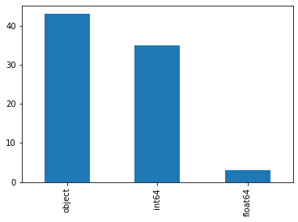
    


```python
proj1.dtypes.value_counts()
```


    object     43
    int64      35
    float64     3
    dtype: int64


```python
proj1.sort_values(['LotFrontage','SalePrice'],ascending=[True,False])

```


<div>
<style scoped>
    .dataframe tbody tr th:only-of-type {
        vertical-align: middle;
    }

    .dataframe tbody tr th {
        vertical-align: top;
    }

    .dataframe thead th {
        text-align: right;
    }
</style>
<table border="1" class="dataframe">
  <thead>
    <tr style="text-align: right;">
      <th></th>
      <th>Id</th>
      <th>MSSubClass</th>
      <th>MSZoning</th>
      <th>LotFrontage</th>
      <th>LotArea</th>
      <th>Street</th>
      <th>Alley</th>
      <th>LotShape</th>
      <th>LandContour</th>
      <th>Utilities</th>
      <th>...</th>
      <th>PoolArea</th>
      <th>PoolQC</th>
      <th>Fence</th>
      <th>MiscFeature</th>
      <th>MiscVal</th>
      <th>MoSold</th>
      <th>YrSold</th>
      <th>SaleType</th>
      <th>SaleCondition</th>
      <th>SalePrice</th>
    </tr>
  </thead>
  <tbody>
    <tr>
      <th>1291</th>
      <td>1292</td>
      <td>160</td>
      <td>RM</td>
      <td>21.0</td>
      <td>1680</td>
      <td>Pave</td>
      <td>NaN</td>
      <td>Reg</td>
      <td>Lvl</td>
      <td>AllPub</td>
      <td>...</td>
      <td>0</td>
      <td>NaN</td>
      <td>NaN</td>
      <td>NaN</td>
      <td>0</td>
      <td>2</td>
      <td>2009</td>
      <td>WD</td>
      <td>Normal</td>
      <td>119500</td>
    </tr>
    <tr>
      <th>363</th>
      <td>364</td>
      <td>160</td>
      <td>RM</td>
      <td>21.0</td>
      <td>1680</td>
      <td>Pave</td>
      <td>NaN</td>
      <td>Reg</td>
      <td>Lvl</td>
      <td>AllPub</td>
      <td>...</td>
      <td>0</td>
      <td>NaN</td>
      <td>NaN</td>
      <td>NaN</td>
      <td>0</td>
      <td>5</td>
      <td>2009</td>
      <td>WD</td>
      <td>Normal</td>
      <td>118000</td>
    </tr>
    <tr>
      <th>1029</th>
      <td>1030</td>
      <td>160</td>
      <td>RM</td>
      <td>21.0</td>
      <td>1680</td>
      <td>Pave</td>
      <td>NaN</td>
      <td>Reg</td>
      <td>Lvl</td>
      <td>AllPub</td>
      <td>...</td>
      <td>0</td>
      <td>NaN</td>
      <td>NaN</td>
      <td>NaN</td>
      <td>0</td>
      <td>5</td>
      <td>2006</td>
      <td>WD</td>
      <td>Normal</td>
      <td>118000</td>
    </tr>
    <tr>
      <th>500</th>
      <td>501</td>
      <td>160</td>
      <td>RM</td>
      <td>21.0</td>
      <td>1890</td>
      <td>Pave</td>
      <td>NaN</td>
      <td>Reg</td>
      <td>Lvl</td>
      <td>AllPub</td>
      <td>...</td>
      <td>0</td>
      <td>NaN</td>
      <td>NaN</td>
      <td>NaN</td>
      <td>0</td>
      <td>5</td>
      <td>2007</td>
      <td>WD</td>
      <td>Normal</td>
      <td>113000</td>
    </tr>
    <tr>
      <th>225</th>
      <td>226</td>
      <td>160</td>
      <td>RM</td>
      <td>21.0</td>
      <td>1680</td>
      <td>Pave</td>
      <td>NaN</td>
      <td>Reg</td>
      <td>Lvl</td>
      <td>AllPub</td>
      <td>...</td>
      <td>0</td>
      <td>NaN</td>
      <td>NaN</td>
      <td>NaN</td>
      <td>0</td>
      <td>5</td>
      <td>2009</td>
      <td>COD</td>
      <td>Abnorml</td>
      <td>112000</td>
    </tr>
    <tr>
      <th>...</th>
      <td>...</td>
      <td>...</td>
      <td>...</td>
      <td>...</td>
      <td>...</td>
      <td>...</td>
      <td>...</td>
      <td>...</td>
      <td>...</td>
      <td>...</td>
      <td>...</td>
      <td>...</td>
      <td>...</td>
      <td>...</td>
      <td>...</td>
      <td>...</td>
      <td>...</td>
      <td>...</td>
      <td>...</td>
      <td>...</td>
      <td>...</td>
    </tr>
    <tr>
      <th>1086</th>
      <td>1087</td>
      <td>160</td>
      <td>RM</td>
      <td>NaN</td>
      <td>1974</td>
      <td>Pave</td>
      <td>NaN</td>
      <td>Reg</td>
      <td>Lvl</td>
      <td>AllPub</td>
      <td>...</td>
      <td>0</td>
      <td>NaN</td>
      <td>NaN</td>
      <td>NaN</td>
      <td>0</td>
      <td>5</td>
      <td>2010</td>
      <td>WD</td>
      <td>Normal</td>
      <td>83500</td>
    </tr>
    <tr>
      <th>308</th>
      <td>309</td>
      <td>30</td>
      <td>RL</td>
      <td>NaN</td>
      <td>12342</td>
      <td>Pave</td>
      <td>NaN</td>
      <td>IR1</td>
      <td>Lvl</td>
      <td>AllPub</td>
      <td>...</td>
      <td>0</td>
      <td>NaN</td>
      <td>NaN</td>
      <td>NaN</td>
      <td>0</td>
      <td>3</td>
      <td>2009</td>
      <td>WD</td>
      <td>Normal</td>
      <td>82500</td>
    </tr>
    <tr>
      <th>1143</th>
      <td>1144</td>
      <td>20</td>
      <td>RL</td>
      <td>NaN</td>
      <td>9000</td>
      <td>Pave</td>
      <td>NaN</td>
      <td>Reg</td>
      <td>Lvl</td>
      <td>AllPub</td>
      <td>...</td>
      <td>0</td>
      <td>NaN</td>
      <td>NaN</td>
      <td>NaN</td>
      <td>0</td>
      <td>7</td>
      <td>2008</td>
      <td>WD</td>
      <td>Normal</td>
      <td>80000</td>
    </tr>
    <tr>
      <th>1321</th>
      <td>1322</td>
      <td>20</td>
      <td>RL</td>
      <td>NaN</td>
      <td>6627</td>
      <td>Pave</td>
      <td>NaN</td>
      <td>IR1</td>
      <td>Lvl</td>
      <td>AllPub</td>
      <td>...</td>
      <td>0</td>
      <td>NaN</td>
      <td>NaN</td>
      <td>NaN</td>
      <td>0</td>
      <td>7</td>
      <td>2008</td>
      <td>WD</td>
      <td>Normal</td>
      <td>72500</td>
    </tr>
    <tr>
      <th>375</th>
      <td>376</td>
      <td>30</td>
      <td>RL</td>
      <td>NaN</td>
      <td>10020</td>
      <td>Pave</td>
      <td>NaN</td>
      <td>IR1</td>
      <td>Low</td>
      <td>AllPub</td>
      <td>...</td>
      <td>0</td>
      <td>NaN</td>
      <td>NaN</td>
      <td>NaN</td>
      <td>0</td>
      <td>3</td>
      <td>2009</td>
      <td>WD</td>
      <td>Normal</td>
      <td>61000</td>
    </tr>
  </tbody>
</table>
<p>1460 rows × 81 columns</p>
</div>


## c.	Identify variables with unique values


```python
proj1.columns
```


    Index(['Id', 'MSSubClass', 'MSZoning', 'LotFrontage', 'LotArea', 'Street',
           'Alley', 'LotShape', 'LandContour', 'Utilities', 'LotConfig',
           'LandSlope', 'Neighborhood', 'Condition1', 'Condition2', 'BldgType',
           'HouseStyle', 'OverallQual', 'OverallCond', 'YearBuilt', 'YearRemodAdd',
           'RoofStyle', 'RoofMatl', 'Exterior1st', 'Exterior2nd', 'MasVnrType',
           'MasVnrArea', 'ExterQual', 'ExterCond', 'Foundation', 'BsmtQual',
           'BsmtCond', 'BsmtExposure', 'BsmtFinType1', 'BsmtFinSF1',
           'BsmtFinType2', 'BsmtFinSF2', 'BsmtUnfSF', 'TotalBsmtSF', 'Heating',
           'HeatingQC', 'CentralAir', 'Electrical', '1stFlrSF', '2ndFlrSF',
           'LowQualFinSF', 'GrLivArea', 'BsmtFullBath', 'BsmtHalfBath', 'FullBath',
           'HalfBath', 'BedroomAbvGr', 'KitchebvGr', 'KitchenQual', 'TotRmsAbvGrd',
           'Functiol', 'Fireplaces', 'FireplaceQu', 'GarageType', 'GarageYrBlt',
           'GarageFinish', 'GarageCars', 'GarageArea', 'GarageQual', 'GarageCond',
           'PavedDrive', 'WoodDeckSF', 'OpenPorchSF', 'EnclosedPorch', '3SsnPorch',
           'ScreenPorch', 'PoolArea', 'PoolQC', 'Fence', 'MiscFeature', 'MiscVal',
           'MoSold', 'YrSold', 'SaleType', 'SaleCondition', 'SalePrice'],
          dtype='object')


```python
proj1['SalePrice'].unique()[:20]
```


    array([208500, 181500, 223500, 140000, 250000, 143000, 307000, 200000,
           129900, 118000, 129500, 345000, 144000, 279500, 157000, 132000,
           149000,  90000, 159000, 139000], dtype=int64)


```python
proj1['LotArea'].unique()[:20]
```


    array([ 8450,  9600, 11250,  9550, 14260, 14115, 10084, 10382,  6120,
            7420, 11200, 11924, 12968, 10652, 10920, 11241, 10791, 13695,
            7560, 14215], dtype=int64)


```python
proj1['LotFrontage'].unique()[:20]
```


    array([ 65.,  80.,  68.,  60.,  84.,  85.,  75.,  nan,  51.,  50.,  70.,
            91.,  72.,  66., 101.,  57.,  44., 110.,  98.,  47.])


```python
proj1['LotFrontage'].value_counts() 
```


    60.0     143
    70.0      70
    80.0      69
    50.0      57
    75.0      53
            ... 
    137.0      1
    141.0      1
    38.0       1
    140.0      1
    46.0       1
    Name: LotFrontage, Length: 110, dtype: int64


```python
proj1['YearBuilt'].unique()[:40] # 2006 most frequent year house built
```


    array([2003, 1976, 2001, 1915, 2000, 1993, 2004, 1973, 1931, 1939, 1965,
           2005, 1962, 2006, 1960, 1929, 1970, 1967, 1958, 1930, 2002, 1968,
           2007, 1951, 1957, 1927, 1920, 1966, 1959, 1994, 1954, 1953, 1955,
           1983, 1975, 1997, 1934, 1963, 1981, 1964], dtype=int64)


```python
proj1['YearBuilt'].value_counts() # 2006 most frequent year house built
```


    2006    67
    2005    64
    2004    54
    2007    49
    2003    45
            ..
    1875     1
    1911     1
    1917     1
    1872     1
    1905     1
    Name: YearBuilt, Length: 112, dtype: int64


```python
proj1['YearBuilt'].min() # 1872 older house for sale
```


    1872


```python
proj1['YearBuilt'].max() # newest house available for sale was built in 2010
```


    2010


```python
proj1['SalePrice'].value_counts(normalize=True)
```


    140000    0.013699
    135000    0.011644
    155000    0.009589
    145000    0.009589
    190000    0.008904
                ...   
    202665    0.000685
    164900    0.000685
    208300    0.000685
    181500    0.000685
    147500    0.000685
    Name: SalePrice, Length: 663, dtype: float64


```python
# Newer homes cost more
plt.figure(figsize=(14,6))
sns.scatterplot(x='YearBuilt',y= 'SalePrice', data=proj1)
plt.show()

```


    
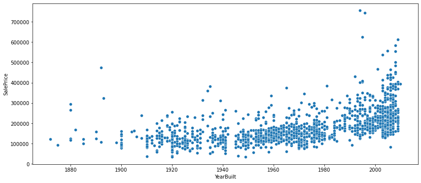
    


```python
plt.figure(figsize=(14,6))
sns.scatterplot(x='GrLivArea',y= 'SalePrice', data=proj1,hue='Fireplaces',palette=['orange','blue','green','black'])
plt.show()
# More house for sales range 1200-2000 sq ft with 1 fireplace
```


    
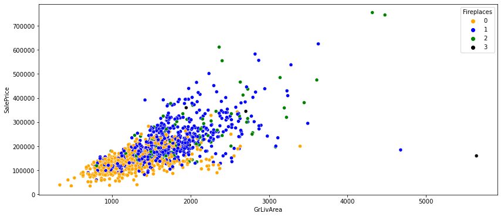
    


```python
proj1.SalePrice.value_counts()
```


    140000    20
    135000    17
    155000    14
    145000    14
    190000    13
              ..
    202665     1
    164900     1
    208300     1
    181500     1
    147500     1
    Name: SalePrice, Length: 663, dtype: int64


```python
proj1['Neighborhood'].value_counts()
```


    mes        225
    CollgCr    150
    OldTown    113
    Edwards    100
    Somerst     86
    Gilbert     79
    NridgHt     77
    Sawyer      74
    NWAmes      73
    SawyerW     59
    BrkSide     58
    Crawfor     51
    Mitchel     49
    NoRidge     41
    Timber      38
    IDOTRR      37
    ClearCr     28
    StoneBr     25
    SWISU       25
    MeadowV     17
    Blmngtn     17
    BrDale      16
    Veenker     11
    NPkVill      9
    Blueste      2
    Name: Neighborhood, dtype: int64


```python
proj1[proj1.GrLivArea>4000].describe()
```


<div>
<style scoped>
    .dataframe tbody tr th:only-of-type {
        vertical-align: middle;
    }

    .dataframe tbody tr th {
        vertical-align: top;
    }

    .dataframe thead th {
        text-align: right;
    }
</style>
<table border="1" class="dataframe">
  <thead>
    <tr style="text-align: right;">
      <th></th>
      <th>Id</th>
      <th>MSSubClass</th>
      <th>LotFrontage</th>
      <th>LotArea</th>
      <th>OverallQual</th>
      <th>OverallCond</th>
      <th>YearBuilt</th>
      <th>YearRemodAdd</th>
      <th>MasVnrArea</th>
      <th>BsmtFinSF1</th>
      <th>...</th>
      <th>WoodDeckSF</th>
      <th>OpenPorchSF</th>
      <th>EnclosedPorch</th>
      <th>3SsnPorch</th>
      <th>ScreenPorch</th>
      <th>PoolArea</th>
      <th>MiscVal</th>
      <th>MoSold</th>
      <th>YrSold</th>
      <th>SalePrice</th>
    </tr>
  </thead>
  <tbody>
    <tr>
      <th>count</th>
      <td>4.000000</td>
      <td>4.0</td>
      <td>4.000000</td>
      <td>4.000000</td>
      <td>4.0</td>
      <td>4.00</td>
      <td>4.000000</td>
      <td>4.000000</td>
      <td>4.000000</td>
      <td>4.000000</td>
      <td>...</td>
      <td>4.000000</td>
      <td>4.00000</td>
      <td>4.0</td>
      <td>4.0</td>
      <td>4.0</td>
      <td>4.000000</td>
      <td>4.0</td>
      <td>4.00</td>
      <td>4.00</td>
      <td>4.00000</td>
    </tr>
    <tr>
      <th>mean</th>
      <td>924.500000</td>
      <td>60.0</td>
      <td>176.750000</td>
      <td>35284.750000</td>
      <td>10.0</td>
      <td>5.25</td>
      <td>2001.250000</td>
      <td>2001.750000</td>
      <td>682.000000</td>
      <td>2863.750000</td>
      <td>...</td>
      <td>243.750000</td>
      <td>206.50000</td>
      <td>0.0</td>
      <td>0.0</td>
      <td>0.0</td>
      <td>258.750000</td>
      <td>0.0</td>
      <td>4.75</td>
      <td>2007.25</td>
      <td>461187.50000</td>
    </tr>
    <tr>
      <th>std</th>
      <td>374.846191</td>
      <td>0.0</td>
      <td>93.670967</td>
      <td>21732.139247</td>
      <td>0.0</td>
      <td>0.50</td>
      <td>7.274384</td>
      <td>7.228416</td>
      <td>490.803423</td>
      <td>1885.764279</td>
      <td>...</td>
      <td>94.107651</td>
      <td>171.38164</td>
      <td>0.0</td>
      <td>0.0</td>
      <td>0.0</td>
      <td>300.343553</td>
      <td>0.0</td>
      <td>4.50</td>
      <td>0.50</td>
      <td>333669.95763</td>
    </tr>
    <tr>
      <th>min</th>
      <td>524.000000</td>
      <td>60.0</td>
      <td>104.000000</td>
      <td>15623.000000</td>
      <td>10.0</td>
      <td>5.00</td>
      <td>1994.000000</td>
      <td>1995.000000</td>
      <td>0.000000</td>
      <td>1455.000000</td>
      <td>...</td>
      <td>171.000000</td>
      <td>50.00000</td>
      <td>0.0</td>
      <td>0.0</td>
      <td>0.0</td>
      <td>0.000000</td>
      <td>0.0</td>
      <td>1.00</td>
      <td>2007.00</td>
      <td>160000.00000</td>
    </tr>
    <tr>
      <th>25%</th>
      <td>650.000000</td>
      <td>60.0</td>
      <td>123.500000</td>
      <td>20057.000000</td>
      <td>10.0</td>
      <td>5.00</td>
      <td>1995.500000</td>
      <td>1995.750000</td>
      <td>571.500000</td>
      <td>1935.750000</td>
      <td>...</td>
      <td>198.750000</td>
      <td>71.00000</td>
      <td>0.0</td>
      <td>0.0</td>
      <td>0.0</td>
      <td>0.000000</td>
      <td>0.0</td>
      <td>1.00</td>
      <td>2007.00</td>
      <td>178562.50000</td>
    </tr>
    <tr>
      <th>50%</th>
      <td>937.500000</td>
      <td>60.0</td>
      <td>145.000000</td>
      <td>30814.500000</td>
      <td>10.0</td>
      <td>5.00</td>
      <td>2001.500000</td>
      <td>2002.000000</td>
      <td>779.000000</td>
      <td>2178.000000</td>
      <td>...</td>
      <td>211.000000</td>
      <td>185.00000</td>
      <td>0.0</td>
      <td>0.0</td>
      <td>0.0</td>
      <td>240.000000</td>
      <td>0.0</td>
      <td>4.00</td>
      <td>2007.00</td>
      <td>464875.00000</td>
    </tr>
    <tr>
      <th>75%</th>
      <td>1212.000000</td>
      <td>60.0</td>
      <td>198.250000</td>
      <td>46042.250000</td>
      <td>10.0</td>
      <td>5.25</td>
      <td>2007.250000</td>
      <td>2008.000000</td>
      <td>889.500000</td>
      <td>3106.000000</td>
      <td>...</td>
      <td>256.000000</td>
      <td>320.50000</td>
      <td>0.0</td>
      <td>0.0</td>
      <td>0.0</td>
      <td>498.750000</td>
      <td>0.0</td>
      <td>7.75</td>
      <td>2007.25</td>
      <td>747500.00000</td>
    </tr>
    <tr>
      <th>max</th>
      <td>1299.000000</td>
      <td>60.0</td>
      <td>313.000000</td>
      <td>63887.000000</td>
      <td>10.0</td>
      <td>6.00</td>
      <td>2008.000000</td>
      <td>2008.000000</td>
      <td>1170.000000</td>
      <td>5644.000000</td>
      <td>...</td>
      <td>382.000000</td>
      <td>406.00000</td>
      <td>0.0</td>
      <td>0.0</td>
      <td>0.0</td>
      <td>555.000000</td>
      <td>0.0</td>
      <td>10.00</td>
      <td>2008.00</td>
      <td>755000.00000</td>
    </tr>
  </tbody>
</table>
<p>8 rows × 38 columns</p>
</div>


```python
proj1[proj1.GrLivArea>4000]
```


<div>
<style scoped>
    .dataframe tbody tr th:only-of-type {
        vertical-align: middle;
    }

    .dataframe tbody tr th {
        vertical-align: top;
    }

    .dataframe thead th {
        text-align: right;
    }
</style>
<table border="1" class="dataframe">
  <thead>
    <tr style="text-align: right;">
      <th></th>
      <th>Id</th>
      <th>MSSubClass</th>
      <th>MSZoning</th>
      <th>LotFrontage</th>
      <th>LotArea</th>
      <th>Street</th>
      <th>Alley</th>
      <th>LotShape</th>
      <th>LandContour</th>
      <th>Utilities</th>
      <th>...</th>
      <th>PoolArea</th>
      <th>PoolQC</th>
      <th>Fence</th>
      <th>MiscFeature</th>
      <th>MiscVal</th>
      <th>MoSold</th>
      <th>YrSold</th>
      <th>SaleType</th>
      <th>SaleCondition</th>
      <th>SalePrice</th>
    </tr>
  </thead>
  <tbody>
    <tr>
      <th>523</th>
      <td>524</td>
      <td>60</td>
      <td>RL</td>
      <td>130.0</td>
      <td>40094</td>
      <td>Pave</td>
      <td>NaN</td>
      <td>IR1</td>
      <td>Bnk</td>
      <td>AllPub</td>
      <td>...</td>
      <td>0</td>
      <td>NaN</td>
      <td>NaN</td>
      <td>NaN</td>
      <td>0</td>
      <td>10</td>
      <td>2007</td>
      <td>New</td>
      <td>Partial</td>
      <td>184750</td>
    </tr>
    <tr>
      <th>691</th>
      <td>692</td>
      <td>60</td>
      <td>RL</td>
      <td>104.0</td>
      <td>21535</td>
      <td>Pave</td>
      <td>NaN</td>
      <td>IR1</td>
      <td>Lvl</td>
      <td>AllPub</td>
      <td>...</td>
      <td>0</td>
      <td>NaN</td>
      <td>NaN</td>
      <td>NaN</td>
      <td>0</td>
      <td>1</td>
      <td>2007</td>
      <td>WD</td>
      <td>Normal</td>
      <td>755000</td>
    </tr>
    <tr>
      <th>1182</th>
      <td>1183</td>
      <td>60</td>
      <td>RL</td>
      <td>160.0</td>
      <td>15623</td>
      <td>Pave</td>
      <td>NaN</td>
      <td>IR1</td>
      <td>Lvl</td>
      <td>AllPub</td>
      <td>...</td>
      <td>555</td>
      <td>Ex</td>
      <td>MnPrv</td>
      <td>NaN</td>
      <td>0</td>
      <td>7</td>
      <td>2007</td>
      <td>WD</td>
      <td>Abnorml</td>
      <td>745000</td>
    </tr>
    <tr>
      <th>1298</th>
      <td>1299</td>
      <td>60</td>
      <td>RL</td>
      <td>313.0</td>
      <td>63887</td>
      <td>Pave</td>
      <td>NaN</td>
      <td>IR3</td>
      <td>Bnk</td>
      <td>AllPub</td>
      <td>...</td>
      <td>480</td>
      <td>Gd</td>
      <td>NaN</td>
      <td>NaN</td>
      <td>0</td>
      <td>1</td>
      <td>2008</td>
      <td>New</td>
      <td>Partial</td>
      <td>160000</td>
    </tr>
  </tbody>
</table>
<p>4 rows × 81 columns</p>
</div>


```python
proj1_cleaned=proj1.dropna()
```


```python
proj1_cleaned.shape
```


    (0, 81)


```python
proj1.describe
```


    <bound method NDFrame.describe of         Id  MSSubClass MSZoning  LotFrontage  LotArea Street Alley LotShape  \
    0        1          60       RL         65.0     8450   Pave   NaN      Reg   
    1        2          20       RL         80.0     9600   Pave   NaN      Reg   
    2        3          60       RL         68.0    11250   Pave   NaN      IR1   
    3        4          70       RL         60.0     9550   Pave   NaN      IR1   
    4        5          60       RL         84.0    14260   Pave   NaN      IR1   
    ...    ...         ...      ...          ...      ...    ...   ...      ...   
    1455  1456          60       RL         62.0     7917   Pave   NaN      Reg   
    1456  1457          20       RL         85.0    13175   Pave   NaN      Reg   
    1457  1458          70       RL         66.0     9042   Pave   NaN      Reg   
    1458  1459          20       RL         68.0     9717   Pave   NaN      Reg   
    1459  1460          20       RL         75.0     9937   Pave   NaN      Reg   
    
         LandContour Utilities  ... PoolArea PoolQC  Fence MiscFeature MiscVal  \
    0            Lvl    AllPub  ...        0    NaN    NaN         NaN       0   
    1            Lvl    AllPub  ...        0    NaN    NaN         NaN       0   
    2            Lvl    AllPub  ...        0    NaN    NaN         NaN       0   
    3            Lvl    AllPub  ...        0    NaN    NaN         NaN       0   
    4            Lvl    AllPub  ...        0    NaN    NaN         NaN       0   
    ...          ...       ...  ...      ...    ...    ...         ...     ...   
    1455         Lvl    AllPub  ...        0    NaN    NaN         NaN       0   
    1456         Lvl    AllPub  ...        0    NaN  MnPrv         NaN       0   
    1457         Lvl    AllPub  ...        0    NaN  GdPrv        Shed    2500   
    1458         Lvl    AllPub  ...        0    NaN    NaN         NaN       0   
    1459         Lvl    AllPub  ...        0    NaN    NaN         NaN       0   
    
         MoSold YrSold  SaleType  SaleCondition  SalePrice  
    0         2   2008        WD         Normal     208500  
    1         5   2007        WD         Normal     181500  
    2         9   2008        WD         Normal     223500  
    3         2   2006        WD        Abnorml     140000  
    4        12   2008        WD         Normal     250000  
    ...     ...    ...       ...            ...        ...  
    1455      8   2007        WD         Normal     175000  
    1456      2   2010        WD         Normal     210000  
    1457      5   2010        WD         Normal     266500  
    1458      4   2010        WD         Normal     142125  
    1459      6   2008        WD         Normal     147500  
    
    [1460 rows x 81 columns]>


```python
proj1['Neighborhood'].value_counts()
```


    mes        225
    CollgCr    150
    OldTown    113
    Edwards    100
    Somerst     86
    Gilbert     79
    NridgHt     77
    Sawyer      74
    NWAmes      73
    SawyerW     59
    BrkSide     58
    Crawfor     51
    Mitchel     49
    NoRidge     41
    Timber      38
    IDOTRR      37
    ClearCr     28
    StoneBr     25
    SWISU       25
    MeadowV     17
    Blmngtn     17
    BrDale      16
    Veenker     11
    NPkVill      9
    Blueste      2
    Name: Neighborhood, dtype: int64


```python
plt.figure(figsize=(14,6))
sns.barplot(x='Neighborhood',y= 'SalePrice', data=proj1)
plt.xticks(rotation=45)
plt.show()

```


    
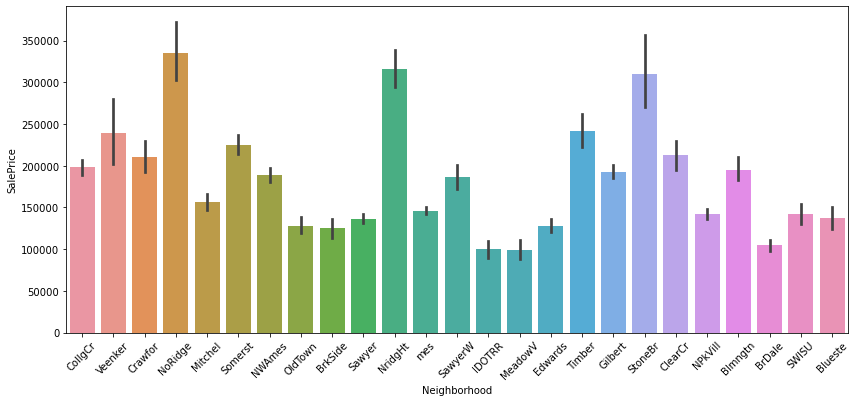
    


# 2.	Generate a separate dataset for numerical and categorical variables


### Numerical 
- Discrete(exp. 1,2,3)int
- Continuous(range) float

### Categroical object


```python
proj1.dtypes
```


    Id                 int64
    MSSubClass         int64
    MSZoning          object
    LotFrontage      float64
    LotArea            int64
                      ...   
    MoSold             int64
    YrSold             int64
    SaleType          object
    SaleCondition     object
    SalePrice          int64
    Length: 81, dtype: object


```python
numerical = proj1.select_dtypes(include=[np.number])
categorical = proj1.select_dtypes(exclude=[np.number])

```


```python
numericcol=numerical.columns.tolist()
categorycol=categorical.columns.tolist()
print ("Category :",categorycol)
print("\n Numeric:", numericcol)


```

    Category : ['MSZoning', 'Street', 'Alley', 'LotShape', 'LandContour', 'Utilities', 'LotConfig', 'LandSlope', 'Neighborhood', 'Condition1', 'Condition2', 'BldgType', 'HouseStyle', 'RoofStyle', 'RoofMatl', 'Exterior1st', 'Exterior2nd', 'MasVnrType', 'ExterQual', 'ExterCond', 'Foundation', 'BsmtQual', 'BsmtCond', 'BsmtExposure', 'BsmtFinType1', 'BsmtFinType2', 'Heating', 'HeatingQC', 'CentralAir', 'Electrical', 'KitchenQual', 'Functiol', 'FireplaceQu', 'GarageType', 'GarageFinish', 'GarageQual', 'GarageCond', 'PavedDrive', 'PoolQC', 'Fence', 'MiscFeature', 'SaleType', 'SaleCondition']
    
     Numeric: ['Id', 'MSSubClass', 'LotFrontage', 'LotArea', 'OverallQual', 'OverallCond', 'YearBuilt', 'YearRemodAdd', 'MasVnrArea', 'BsmtFinSF1', 'BsmtFinSF2', 'BsmtUnfSF', 'TotalBsmtSF', '1stFlrSF', '2ndFlrSF', 'LowQualFinSF', 'GrLivArea', 'BsmtFullBath', 'BsmtHalfBath', 'FullBath', 'HalfBath', 'BedroomAbvGr', 'KitchebvGr', 'TotRmsAbvGrd', 'Fireplaces', 'GarageYrBlt', 'GarageCars', 'GarageArea', 'WoodDeckSF', 'OpenPorchSF', 'EnclosedPorch', '3SsnPorch', 'ScreenPorch', 'PoolArea', 'MiscVal', 'MoSold', 'YrSold', 'SalePrice']
    

## 3.	EDA of numerical variables:


```python
numerical.head()
```


<div>
<style scoped>
    .dataframe tbody tr th:only-of-type {
        vertical-align: middle;
    }

    .dataframe tbody tr th {
        vertical-align: top;
    }

    .dataframe thead th {
        text-align: right;
    }
</style>
<table border="1" class="dataframe">
  <thead>
    <tr style="text-align: right;">
      <th></th>
      <th>Id</th>
      <th>MSSubClass</th>
      <th>LotFrontage</th>
      <th>LotArea</th>
      <th>OverallQual</th>
      <th>OverallCond</th>
      <th>YearBuilt</th>
      <th>YearRemodAdd</th>
      <th>MasVnrArea</th>
      <th>BsmtFinSF1</th>
      <th>...</th>
      <th>WoodDeckSF</th>
      <th>OpenPorchSF</th>
      <th>EnclosedPorch</th>
      <th>3SsnPorch</th>
      <th>ScreenPorch</th>
      <th>PoolArea</th>
      <th>MiscVal</th>
      <th>MoSold</th>
      <th>YrSold</th>
      <th>SalePrice</th>
    </tr>
  </thead>
  <tbody>
    <tr>
      <th>0</th>
      <td>1</td>
      <td>60</td>
      <td>65.0</td>
      <td>8450</td>
      <td>7</td>
      <td>5</td>
      <td>2003</td>
      <td>2003</td>
      <td>196.0</td>
      <td>706</td>
      <td>...</td>
      <td>0</td>
      <td>61</td>
      <td>0</td>
      <td>0</td>
      <td>0</td>
      <td>0</td>
      <td>0</td>
      <td>2</td>
      <td>2008</td>
      <td>208500</td>
    </tr>
    <tr>
      <th>1</th>
      <td>2</td>
      <td>20</td>
      <td>80.0</td>
      <td>9600</td>
      <td>6</td>
      <td>8</td>
      <td>1976</td>
      <td>1976</td>
      <td>0.0</td>
      <td>978</td>
      <td>...</td>
      <td>298</td>
      <td>0</td>
      <td>0</td>
      <td>0</td>
      <td>0</td>
      <td>0</td>
      <td>0</td>
      <td>5</td>
      <td>2007</td>
      <td>181500</td>
    </tr>
    <tr>
      <th>2</th>
      <td>3</td>
      <td>60</td>
      <td>68.0</td>
      <td>11250</td>
      <td>7</td>
      <td>5</td>
      <td>2001</td>
      <td>2002</td>
      <td>162.0</td>
      <td>486</td>
      <td>...</td>
      <td>0</td>
      <td>42</td>
      <td>0</td>
      <td>0</td>
      <td>0</td>
      <td>0</td>
      <td>0</td>
      <td>9</td>
      <td>2008</td>
      <td>223500</td>
    </tr>
    <tr>
      <th>3</th>
      <td>4</td>
      <td>70</td>
      <td>60.0</td>
      <td>9550</td>
      <td>7</td>
      <td>5</td>
      <td>1915</td>
      <td>1970</td>
      <td>0.0</td>
      <td>216</td>
      <td>...</td>
      <td>0</td>
      <td>35</td>
      <td>272</td>
      <td>0</td>
      <td>0</td>
      <td>0</td>
      <td>0</td>
      <td>2</td>
      <td>2006</td>
      <td>140000</td>
    </tr>
    <tr>
      <th>4</th>
      <td>5</td>
      <td>60</td>
      <td>84.0</td>
      <td>14260</td>
      <td>8</td>
      <td>5</td>
      <td>2000</td>
      <td>2000</td>
      <td>350.0</td>
      <td>655</td>
      <td>...</td>
      <td>192</td>
      <td>84</td>
      <td>0</td>
      <td>0</td>
      <td>0</td>
      <td>0</td>
      <td>0</td>
      <td>12</td>
      <td>2008</td>
      <td>250000</td>
    </tr>
  </tbody>
</table>
<p>5 rows × 38 columns</p>
</div>


### a.	Missing value treatment


```python
# check if there is a missing value in the data
numerical.isna().any()
```


    Id               False
    MSSubClass       False
    LotFrontage       True
    LotArea          False
    OverallQual      False
    OverallCond      False
    YearBuilt        False
    YearRemodAdd     False
    MasVnrArea        True
    BsmtFinSF1       False
    BsmtFinSF2       False
    BsmtUnfSF        False
    TotalBsmtSF      False
    1stFlrSF         False
    2ndFlrSF         False
    LowQualFinSF     False
    GrLivArea        False
    BsmtFullBath     False
    BsmtHalfBath     False
    FullBath         False
    HalfBath         False
    BedroomAbvGr     False
    KitchebvGr       False
    TotRmsAbvGrd     False
    Fireplaces       False
    GarageYrBlt       True
    GarageCars       False
    GarageArea       False
    WoodDeckSF       False
    OpenPorchSF      False
    EnclosedPorch    False
    3SsnPorch        False
    ScreenPorch      False
    PoolArea         False
    MiscVal          False
    MoSold           False
    YrSold           False
    SalePrice        False
    dtype: bool


```python
numerical.isna().sum()*100/proj1.shape[0]
```


    Id                0.000000
    MSSubClass        0.000000
    LotFrontage      17.739726
    LotArea           0.000000
    OverallQual       0.000000
    OverallCond       0.000000
    YearBuilt         0.000000
    YearRemodAdd      0.000000
    MasVnrArea        0.547945
    BsmtFinSF1        0.000000
    BsmtFinSF2        0.000000
    BsmtUnfSF         0.000000
    TotalBsmtSF       0.000000
    1stFlrSF          0.000000
    2ndFlrSF          0.000000
    LowQualFinSF      0.000000
    GrLivArea         0.000000
    BsmtFullBath      0.000000
    BsmtHalfBath      0.000000
    FullBath          0.000000
    HalfBath          0.000000
    BedroomAbvGr      0.000000
    KitchebvGr        0.000000
    TotRmsAbvGrd      0.000000
    Fireplaces        0.000000
    GarageYrBlt       5.547945
    GarageCars        0.000000
    GarageArea        0.000000
    WoodDeckSF        0.000000
    OpenPorchSF       0.000000
    EnclosedPorch     0.000000
    3SsnPorch         0.000000
    ScreenPorch       0.000000
    PoolArea          0.000000
    MiscVal           0.000000
    MoSold            0.000000
    YrSold            0.000000
    SalePrice         0.000000
    dtype: float64


```python
numerical.shape
```


    (1460, 38)


```python
# dropping the rows where we have a missing value
numerical_cleaned=numerical.dropna()
```


```python
numerical_cleaned.shape
```


    (1121, 38)


```python
numerical.describe()
```


<div>
<style scoped>
    .dataframe tbody tr th:only-of-type {
        vertical-align: middle;
    }

    .dataframe tbody tr th {
        vertical-align: top;
    }

    .dataframe thead th {
        text-align: right;
    }
</style>
<table border="1" class="dataframe">
  <thead>
    <tr style="text-align: right;">
      <th></th>
      <th>Id</th>
      <th>MSSubClass</th>
      <th>LotFrontage</th>
      <th>LotArea</th>
      <th>OverallQual</th>
      <th>OverallCond</th>
      <th>YearBuilt</th>
      <th>YearRemodAdd</th>
      <th>MasVnrArea</th>
      <th>BsmtFinSF1</th>
      <th>...</th>
      <th>WoodDeckSF</th>
      <th>OpenPorchSF</th>
      <th>EnclosedPorch</th>
      <th>3SsnPorch</th>
      <th>ScreenPorch</th>
      <th>PoolArea</th>
      <th>MiscVal</th>
      <th>MoSold</th>
      <th>YrSold</th>
      <th>SalePrice</th>
    </tr>
  </thead>
  <tbody>
    <tr>
      <th>count</th>
      <td>1460.000000</td>
      <td>1460.000000</td>
      <td>1201.000000</td>
      <td>1460.000000</td>
      <td>1460.000000</td>
      <td>1460.000000</td>
      <td>1460.000000</td>
      <td>1460.000000</td>
      <td>1452.000000</td>
      <td>1460.000000</td>
      <td>...</td>
      <td>1460.000000</td>
      <td>1460.000000</td>
      <td>1460.000000</td>
      <td>1460.000000</td>
      <td>1460.000000</td>
      <td>1460.000000</td>
      <td>1460.000000</td>
      <td>1460.000000</td>
      <td>1460.000000</td>
      <td>1460.000000</td>
    </tr>
    <tr>
      <th>mean</th>
      <td>730.500000</td>
      <td>56.897260</td>
      <td>70.049958</td>
      <td>10516.828082</td>
      <td>6.099315</td>
      <td>5.575342</td>
      <td>1971.267808</td>
      <td>1984.865753</td>
      <td>103.685262</td>
      <td>443.639726</td>
      <td>...</td>
      <td>94.244521</td>
      <td>46.660274</td>
      <td>21.954110</td>
      <td>3.409589</td>
      <td>15.060959</td>
      <td>2.758904</td>
      <td>43.489041</td>
      <td>6.321918</td>
      <td>2007.815753</td>
      <td>180921.195890</td>
    </tr>
    <tr>
      <th>std</th>
      <td>421.610009</td>
      <td>42.300571</td>
      <td>24.284752</td>
      <td>9981.264932</td>
      <td>1.382997</td>
      <td>1.112799</td>
      <td>30.202904</td>
      <td>20.645407</td>
      <td>181.066207</td>
      <td>456.098091</td>
      <td>...</td>
      <td>125.338794</td>
      <td>66.256028</td>
      <td>61.119149</td>
      <td>29.317331</td>
      <td>55.757415</td>
      <td>40.177307</td>
      <td>496.123024</td>
      <td>2.703626</td>
      <td>1.328095</td>
      <td>79442.502883</td>
    </tr>
    <tr>
      <th>min</th>
      <td>1.000000</td>
      <td>20.000000</td>
      <td>21.000000</td>
      <td>1300.000000</td>
      <td>1.000000</td>
      <td>1.000000</td>
      <td>1872.000000</td>
      <td>1950.000000</td>
      <td>0.000000</td>
      <td>0.000000</td>
      <td>...</td>
      <td>0.000000</td>
      <td>0.000000</td>
      <td>0.000000</td>
      <td>0.000000</td>
      <td>0.000000</td>
      <td>0.000000</td>
      <td>0.000000</td>
      <td>1.000000</td>
      <td>2006.000000</td>
      <td>34900.000000</td>
    </tr>
    <tr>
      <th>25%</th>
      <td>365.750000</td>
      <td>20.000000</td>
      <td>59.000000</td>
      <td>7553.500000</td>
      <td>5.000000</td>
      <td>5.000000</td>
      <td>1954.000000</td>
      <td>1967.000000</td>
      <td>0.000000</td>
      <td>0.000000</td>
      <td>...</td>
      <td>0.000000</td>
      <td>0.000000</td>
      <td>0.000000</td>
      <td>0.000000</td>
      <td>0.000000</td>
      <td>0.000000</td>
      <td>0.000000</td>
      <td>5.000000</td>
      <td>2007.000000</td>
      <td>129975.000000</td>
    </tr>
    <tr>
      <th>50%</th>
      <td>730.500000</td>
      <td>50.000000</td>
      <td>69.000000</td>
      <td>9478.500000</td>
      <td>6.000000</td>
      <td>5.000000</td>
      <td>1973.000000</td>
      <td>1994.000000</td>
      <td>0.000000</td>
      <td>383.500000</td>
      <td>...</td>
      <td>0.000000</td>
      <td>25.000000</td>
      <td>0.000000</td>
      <td>0.000000</td>
      <td>0.000000</td>
      <td>0.000000</td>
      <td>0.000000</td>
      <td>6.000000</td>
      <td>2008.000000</td>
      <td>163000.000000</td>
    </tr>
    <tr>
      <th>75%</th>
      <td>1095.250000</td>
      <td>70.000000</td>
      <td>80.000000</td>
      <td>11601.500000</td>
      <td>7.000000</td>
      <td>6.000000</td>
      <td>2000.000000</td>
      <td>2004.000000</td>
      <td>166.000000</td>
      <td>712.250000</td>
      <td>...</td>
      <td>168.000000</td>
      <td>68.000000</td>
      <td>0.000000</td>
      <td>0.000000</td>
      <td>0.000000</td>
      <td>0.000000</td>
      <td>0.000000</td>
      <td>8.000000</td>
      <td>2009.000000</td>
      <td>214000.000000</td>
    </tr>
    <tr>
      <th>max</th>
      <td>1460.000000</td>
      <td>190.000000</td>
      <td>313.000000</td>
      <td>215245.000000</td>
      <td>10.000000</td>
      <td>9.000000</td>
      <td>2010.000000</td>
      <td>2010.000000</td>
      <td>1600.000000</td>
      <td>5644.000000</td>
      <td>...</td>
      <td>857.000000</td>
      <td>547.000000</td>
      <td>552.000000</td>
      <td>508.000000</td>
      <td>480.000000</td>
      <td>738.000000</td>
      <td>15500.000000</td>
      <td>12.000000</td>
      <td>2010.000000</td>
      <td>755000.000000</td>
    </tr>
  </tbody>
</table>
<p>8 rows × 38 columns</p>
</div>


### b.	Identify the skewness and distribution


```python
proj1.skew(skipna=True)
```

    C:\Users\Shark\AppData\Local\Temp\ipykernel_18600\310152976.py:1: FutureWarning: Dropping of nuisance columns in DataFrame reductions (with 'numeric_only=None') is deprecated; in a future version this will raise TypeError.  Select only valid columns before calling the reduction.
      proj1.skew(skipna=True)
    


    Id                0.000000
    MSSubClass        1.407657
    LotFrontage       2.163569
    LotArea          12.207688
    OverallQual       0.216944
    OverallCond       0.693067
    YearBuilt        -0.613461
    YearRemodAdd     -0.503562
    MasVnrArea        2.669084
    BsmtFinSF1        1.685503
    BsmtFinSF2        4.255261
    BsmtUnfSF         0.920268
    TotalBsmtSF       1.524255
    1stFlrSF          1.376757
    2ndFlrSF          0.813030
    LowQualFinSF      9.011341
    GrLivArea         1.366560
    BsmtFullBath      0.596067
    BsmtHalfBath      4.103403
    FullBath          0.036562
    HalfBath          0.675897
    BedroomAbvGr      0.211790
    KitchebvGr        4.488397
    TotRmsAbvGrd      0.676341
    Fireplaces        0.649565
    GarageYrBlt      -0.649415
    GarageCars       -0.342549
    GarageArea        0.179981
    WoodDeckSF        1.541376
    OpenPorchSF       2.364342
    EnclosedPorch     3.089872
    3SsnPorch        10.304342
    ScreenPorch       4.122214
    PoolArea         14.828374
    MiscVal          24.476794
    MoSold            0.212053
    YrSold            0.096269
    SalePrice         1.882876
    dtype: float64


```python
fig = plt.figure(figsize =(20, 10))

proj1.skew().plot()
```

    C:\Users\Shark\AppData\Local\Temp\ipykernel_18600\2135391446.py:3: FutureWarning: Dropping of nuisance columns in DataFrame reductions (with 'numeric_only=None') is deprecated; in a future version this will raise TypeError.  Select only valid columns before calling the reduction.
      proj1.skew().plot()
    


    <AxesSubplot:>


    
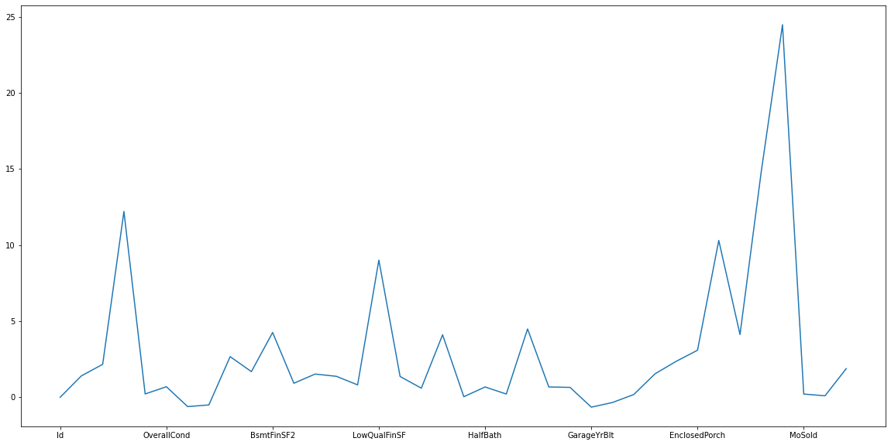
    


### c.	Identify significant variables using a correlation matrix 


```python
numerical.var()
```


    Id               1.777550e+05
    MSSubClass       1.789338e+03
    LotFrontage      5.897492e+02
    LotArea          9.962565e+07
    OverallQual      1.912679e+00
    OverallCond      1.238322e+00
    YearBuilt        9.122154e+02
    YearRemodAdd     4.262328e+02
    MasVnrArea       3.278497e+04
    BsmtFinSF1       2.080255e+05
    BsmtFinSF2       2.602391e+04
    BsmtUnfSF        1.952464e+05
    TotalBsmtSF      1.924624e+05
    1stFlrSF         1.494501e+05
    2ndFlrSF         1.905571e+05
    LowQualFinSF     2.364204e+03
    GrLivArea        2.761296e+05
    BsmtFullBath     2.692682e-01
    BsmtHalfBath     5.700283e-02
    FullBath         3.035082e-01
    HalfBath         2.528937e-01
    BedroomAbvGr     6.654938e-01
    KitchebvGr       4.854892e-02
    TotRmsAbvGrd     2.641903e+00
    Fireplaces       4.155947e-01
    GarageYrBlt      6.095825e+02
    GarageCars       5.584797e-01
    GarageArea       4.571251e+04
    WoodDeckSF       1.570981e+04
    OpenPorchSF      4.389861e+03
    EnclosedPorch    3.735550e+03
    3SsnPorch        8.595059e+02
    ScreenPorch      3.108889e+03
    PoolArea         1.614216e+03
    MiscVal          2.461381e+05
    MoSold           7.309595e+00
    YrSold           1.763837e+00
    SalePrice        6.311111e+09
    dtype: float64


```python
numerical.head()
```


<div>
<style scoped>
    .dataframe tbody tr th:only-of-type {
        vertical-align: middle;
    }

    .dataframe tbody tr th {
        vertical-align: top;
    }

    .dataframe thead th {
        text-align: right;
    }
</style>
<table border="1" class="dataframe">
  <thead>
    <tr style="text-align: right;">
      <th></th>
      <th>Id</th>
      <th>MSSubClass</th>
      <th>LotFrontage</th>
      <th>LotArea</th>
      <th>OverallQual</th>
      <th>OverallCond</th>
      <th>YearBuilt</th>
      <th>YearRemodAdd</th>
      <th>MasVnrArea</th>
      <th>BsmtFinSF1</th>
      <th>...</th>
      <th>WoodDeckSF</th>
      <th>OpenPorchSF</th>
      <th>EnclosedPorch</th>
      <th>3SsnPorch</th>
      <th>ScreenPorch</th>
      <th>PoolArea</th>
      <th>MiscVal</th>
      <th>MoSold</th>
      <th>YrSold</th>
      <th>SalePrice</th>
    </tr>
  </thead>
  <tbody>
    <tr>
      <th>0</th>
      <td>1</td>
      <td>60</td>
      <td>65.0</td>
      <td>8450</td>
      <td>7</td>
      <td>5</td>
      <td>2003</td>
      <td>2003</td>
      <td>196.0</td>
      <td>706</td>
      <td>...</td>
      <td>0</td>
      <td>61</td>
      <td>0</td>
      <td>0</td>
      <td>0</td>
      <td>0</td>
      <td>0</td>
      <td>2</td>
      <td>2008</td>
      <td>208500</td>
    </tr>
    <tr>
      <th>1</th>
      <td>2</td>
      <td>20</td>
      <td>80.0</td>
      <td>9600</td>
      <td>6</td>
      <td>8</td>
      <td>1976</td>
      <td>1976</td>
      <td>0.0</td>
      <td>978</td>
      <td>...</td>
      <td>298</td>
      <td>0</td>
      <td>0</td>
      <td>0</td>
      <td>0</td>
      <td>0</td>
      <td>0</td>
      <td>5</td>
      <td>2007</td>
      <td>181500</td>
    </tr>
    <tr>
      <th>2</th>
      <td>3</td>
      <td>60</td>
      <td>68.0</td>
      <td>11250</td>
      <td>7</td>
      <td>5</td>
      <td>2001</td>
      <td>2002</td>
      <td>162.0</td>
      <td>486</td>
      <td>...</td>
      <td>0</td>
      <td>42</td>
      <td>0</td>
      <td>0</td>
      <td>0</td>
      <td>0</td>
      <td>0</td>
      <td>9</td>
      <td>2008</td>
      <td>223500</td>
    </tr>
    <tr>
      <th>3</th>
      <td>4</td>
      <td>70</td>
      <td>60.0</td>
      <td>9550</td>
      <td>7</td>
      <td>5</td>
      <td>1915</td>
      <td>1970</td>
      <td>0.0</td>
      <td>216</td>
      <td>...</td>
      <td>0</td>
      <td>35</td>
      <td>272</td>
      <td>0</td>
      <td>0</td>
      <td>0</td>
      <td>0</td>
      <td>2</td>
      <td>2006</td>
      <td>140000</td>
    </tr>
    <tr>
      <th>4</th>
      <td>5</td>
      <td>60</td>
      <td>84.0</td>
      <td>14260</td>
      <td>8</td>
      <td>5</td>
      <td>2000</td>
      <td>2000</td>
      <td>350.0</td>
      <td>655</td>
      <td>...</td>
      <td>192</td>
      <td>84</td>
      <td>0</td>
      <td>0</td>
      <td>0</td>
      <td>0</td>
      <td>0</td>
      <td>12</td>
      <td>2008</td>
      <td>250000</td>
    </tr>
  </tbody>
</table>
<p>5 rows × 38 columns</p>
</div>


```python
numerical.corr(method='pearson')
```


<div>
<style scoped>
    .dataframe tbody tr th:only-of-type {
        vertical-align: middle;
    }

    .dataframe tbody tr th {
        vertical-align: top;
    }

    .dataframe thead th {
        text-align: right;
    }
</style>
<table border="1" class="dataframe">
  <thead>
    <tr style="text-align: right;">
      <th></th>
      <th>Id</th>
      <th>MSSubClass</th>
      <th>LotFrontage</th>
      <th>LotArea</th>
      <th>OverallQual</th>
      <th>OverallCond</th>
      <th>YearBuilt</th>
      <th>YearRemodAdd</th>
      <th>MasVnrArea</th>
      <th>BsmtFinSF1</th>
      <th>...</th>
      <th>WoodDeckSF</th>
      <th>OpenPorchSF</th>
      <th>EnclosedPorch</th>
      <th>3SsnPorch</th>
      <th>ScreenPorch</th>
      <th>PoolArea</th>
      <th>MiscVal</th>
      <th>MoSold</th>
      <th>YrSold</th>
      <th>SalePrice</th>
    </tr>
  </thead>
  <tbody>
    <tr>
      <th>Id</th>
      <td>1.000000</td>
      <td>0.011156</td>
      <td>-0.010601</td>
      <td>-0.033226</td>
      <td>-0.028365</td>
      <td>0.012609</td>
      <td>-0.012713</td>
      <td>-0.021998</td>
      <td>-0.050298</td>
      <td>-0.005024</td>
      <td>...</td>
      <td>-0.029643</td>
      <td>-0.000477</td>
      <td>0.002889</td>
      <td>-0.046635</td>
      <td>0.001330</td>
      <td>0.057044</td>
      <td>-0.006242</td>
      <td>0.021172</td>
      <td>0.000712</td>
      <td>-0.021917</td>
    </tr>
    <tr>
      <th>MSSubClass</th>
      <td>0.011156</td>
      <td>1.000000</td>
      <td>-0.386347</td>
      <td>-0.139781</td>
      <td>0.032628</td>
      <td>-0.059316</td>
      <td>0.027850</td>
      <td>0.040581</td>
      <td>0.022936</td>
      <td>-0.069836</td>
      <td>...</td>
      <td>-0.012579</td>
      <td>-0.006100</td>
      <td>-0.012037</td>
      <td>-0.043825</td>
      <td>-0.026030</td>
      <td>0.008283</td>
      <td>-0.007683</td>
      <td>-0.013585</td>
      <td>-0.021407</td>
      <td>-0.084284</td>
    </tr>
    <tr>
      <th>LotFrontage</th>
      <td>-0.010601</td>
      <td>-0.386347</td>
      <td>1.000000</td>
      <td>0.426095</td>
      <td>0.251646</td>
      <td>-0.059213</td>
      <td>0.123349</td>
      <td>0.088866</td>
      <td>0.193458</td>
      <td>0.233633</td>
      <td>...</td>
      <td>0.088521</td>
      <td>0.151972</td>
      <td>0.010700</td>
      <td>0.070029</td>
      <td>0.041383</td>
      <td>0.206167</td>
      <td>0.003368</td>
      <td>0.011200</td>
      <td>0.007450</td>
      <td>0.351799</td>
    </tr>
    <tr>
      <th>LotArea</th>
      <td>-0.033226</td>
      <td>-0.139781</td>
      <td>0.426095</td>
      <td>1.000000</td>
      <td>0.105806</td>
      <td>-0.005636</td>
      <td>0.014228</td>
      <td>0.013788</td>
      <td>0.104160</td>
      <td>0.214103</td>
      <td>...</td>
      <td>0.171698</td>
      <td>0.084774</td>
      <td>-0.018340</td>
      <td>0.020423</td>
      <td>0.043160</td>
      <td>0.077672</td>
      <td>0.038068</td>
      <td>0.001205</td>
      <td>-0.014261</td>
      <td>0.263843</td>
    </tr>
    <tr>
      <th>OverallQual</th>
      <td>-0.028365</td>
      <td>0.032628</td>
      <td>0.251646</td>
      <td>0.105806</td>
      <td>1.000000</td>
      <td>-0.091932</td>
      <td>0.572323</td>
      <td>0.550684</td>
      <td>0.411876</td>
      <td>0.239666</td>
      <td>...</td>
      <td>0.238923</td>
      <td>0.308819</td>
      <td>-0.113937</td>
      <td>0.030371</td>
      <td>0.064886</td>
      <td>0.065166</td>
      <td>-0.031406</td>
      <td>0.070815</td>
      <td>-0.027347</td>
      <td>0.790982</td>
    </tr>
    <tr>
      <th>OverallCond</th>
      <td>0.012609</td>
      <td>-0.059316</td>
      <td>-0.059213</td>
      <td>-0.005636</td>
      <td>-0.091932</td>
      <td>1.000000</td>
      <td>-0.375983</td>
      <td>0.073741</td>
      <td>-0.128101</td>
      <td>-0.046231</td>
      <td>...</td>
      <td>-0.003334</td>
      <td>-0.032589</td>
      <td>0.070356</td>
      <td>0.025504</td>
      <td>0.054811</td>
      <td>-0.001985</td>
      <td>0.068777</td>
      <td>-0.003511</td>
      <td>0.043950</td>
      <td>-0.077856</td>
    </tr>
    <tr>
      <th>YearBuilt</th>
      <td>-0.012713</td>
      <td>0.027850</td>
      <td>0.123349</td>
      <td>0.014228</td>
      <td>0.572323</td>
      <td>-0.375983</td>
      <td>1.000000</td>
      <td>0.592855</td>
      <td>0.315707</td>
      <td>0.249503</td>
      <td>...</td>
      <td>0.224880</td>
      <td>0.188686</td>
      <td>-0.387268</td>
      <td>0.031355</td>
      <td>-0.050364</td>
      <td>0.004950</td>
      <td>-0.034383</td>
      <td>0.012398</td>
      <td>-0.013618</td>
      <td>0.522897</td>
    </tr>
    <tr>
      <th>YearRemodAdd</th>
      <td>-0.021998</td>
      <td>0.040581</td>
      <td>0.088866</td>
      <td>0.013788</td>
      <td>0.550684</td>
      <td>0.073741</td>
      <td>0.592855</td>
      <td>1.000000</td>
      <td>0.179618</td>
      <td>0.128451</td>
      <td>...</td>
      <td>0.205726</td>
      <td>0.226298</td>
      <td>-0.193919</td>
      <td>0.045286</td>
      <td>-0.038740</td>
      <td>0.005829</td>
      <td>-0.010286</td>
      <td>0.021490</td>
      <td>0.035743</td>
      <td>0.507101</td>
    </tr>
    <tr>
      <th>MasVnrArea</th>
      <td>-0.050298</td>
      <td>0.022936</td>
      <td>0.193458</td>
      <td>0.104160</td>
      <td>0.411876</td>
      <td>-0.128101</td>
      <td>0.315707</td>
      <td>0.179618</td>
      <td>1.000000</td>
      <td>0.264736</td>
      <td>...</td>
      <td>0.159718</td>
      <td>0.125703</td>
      <td>-0.110204</td>
      <td>0.018796</td>
      <td>0.061466</td>
      <td>0.011723</td>
      <td>-0.029815</td>
      <td>-0.005965</td>
      <td>-0.008201</td>
      <td>0.477493</td>
    </tr>
    <tr>
      <th>BsmtFinSF1</th>
      <td>-0.005024</td>
      <td>-0.069836</td>
      <td>0.233633</td>
      <td>0.214103</td>
      <td>0.239666</td>
      <td>-0.046231</td>
      <td>0.249503</td>
      <td>0.128451</td>
      <td>0.264736</td>
      <td>1.000000</td>
      <td>...</td>
      <td>0.204306</td>
      <td>0.111761</td>
      <td>-0.102303</td>
      <td>0.026451</td>
      <td>0.062021</td>
      <td>0.140491</td>
      <td>0.003571</td>
      <td>-0.015727</td>
      <td>0.014359</td>
      <td>0.386420</td>
    </tr>
    <tr>
      <th>BsmtFinSF2</th>
      <td>-0.005968</td>
      <td>-0.065649</td>
      <td>0.049900</td>
      <td>0.111170</td>
      <td>-0.059119</td>
      <td>0.040229</td>
      <td>-0.049107</td>
      <td>-0.067759</td>
      <td>-0.072319</td>
      <td>-0.050117</td>
      <td>...</td>
      <td>0.067898</td>
      <td>0.003093</td>
      <td>0.036543</td>
      <td>-0.029993</td>
      <td>0.088871</td>
      <td>0.041709</td>
      <td>0.004940</td>
      <td>-0.015211</td>
      <td>0.031706</td>
      <td>-0.011378</td>
    </tr>
    <tr>
      <th>BsmtUnfSF</th>
      <td>-0.007940</td>
      <td>-0.140759</td>
      <td>0.132644</td>
      <td>-0.002618</td>
      <td>0.308159</td>
      <td>-0.136841</td>
      <td>0.149040</td>
      <td>0.181133</td>
      <td>0.114442</td>
      <td>-0.495251</td>
      <td>...</td>
      <td>-0.005316</td>
      <td>0.129005</td>
      <td>-0.002538</td>
      <td>0.020764</td>
      <td>-0.012579</td>
      <td>-0.035092</td>
      <td>-0.023837</td>
      <td>0.034888</td>
      <td>-0.041258</td>
      <td>0.214479</td>
    </tr>
    <tr>
      <th>TotalBsmtSF</th>
      <td>-0.015415</td>
      <td>-0.238518</td>
      <td>0.392075</td>
      <td>0.260833</td>
      <td>0.537808</td>
      <td>-0.171098</td>
      <td>0.391452</td>
      <td>0.291066</td>
      <td>0.363936</td>
      <td>0.522396</td>
      <td>...</td>
      <td>0.232019</td>
      <td>0.247264</td>
      <td>-0.095478</td>
      <td>0.037384</td>
      <td>0.084489</td>
      <td>0.126053</td>
      <td>-0.018479</td>
      <td>0.013196</td>
      <td>-0.014969</td>
      <td>0.613581</td>
    </tr>
    <tr>
      <th>1stFlrSF</th>
      <td>0.010496</td>
      <td>-0.251758</td>
      <td>0.457181</td>
      <td>0.299475</td>
      <td>0.476224</td>
      <td>-0.144203</td>
      <td>0.281986</td>
      <td>0.240379</td>
      <td>0.344501</td>
      <td>0.445863</td>
      <td>...</td>
      <td>0.235459</td>
      <td>0.211671</td>
      <td>-0.065292</td>
      <td>0.056104</td>
      <td>0.088758</td>
      <td>0.131525</td>
      <td>-0.021096</td>
      <td>0.031372</td>
      <td>-0.013604</td>
      <td>0.605852</td>
    </tr>
    <tr>
      <th>2ndFlrSF</th>
      <td>0.005590</td>
      <td>0.307886</td>
      <td>0.080177</td>
      <td>0.050986</td>
      <td>0.295493</td>
      <td>0.028942</td>
      <td>0.010308</td>
      <td>0.140024</td>
      <td>0.174561</td>
      <td>-0.137079</td>
      <td>...</td>
      <td>0.092165</td>
      <td>0.208026</td>
      <td>0.061989</td>
      <td>-0.024358</td>
      <td>0.040606</td>
      <td>0.081487</td>
      <td>0.016197</td>
      <td>0.035164</td>
      <td>-0.028700</td>
      <td>0.319334</td>
    </tr>
    <tr>
      <th>LowQualFinSF</th>
      <td>-0.044230</td>
      <td>0.046474</td>
      <td>0.038469</td>
      <td>0.004779</td>
      <td>-0.030429</td>
      <td>0.025494</td>
      <td>-0.183784</td>
      <td>-0.062419</td>
      <td>-0.069071</td>
      <td>-0.064503</td>
      <td>...</td>
      <td>-0.025444</td>
      <td>0.018251</td>
      <td>0.061081</td>
      <td>-0.004296</td>
      <td>0.026799</td>
      <td>0.062157</td>
      <td>-0.003793</td>
      <td>-0.022174</td>
      <td>-0.028921</td>
      <td>-0.025606</td>
    </tr>
    <tr>
      <th>GrLivArea</th>
      <td>0.008273</td>
      <td>0.074853</td>
      <td>0.402797</td>
      <td>0.263116</td>
      <td>0.593007</td>
      <td>-0.079686</td>
      <td>0.199010</td>
      <td>0.287389</td>
      <td>0.390857</td>
      <td>0.208171</td>
      <td>...</td>
      <td>0.247433</td>
      <td>0.330224</td>
      <td>0.009113</td>
      <td>0.020643</td>
      <td>0.101510</td>
      <td>0.170205</td>
      <td>-0.002416</td>
      <td>0.050240</td>
      <td>-0.036526</td>
      <td>0.708624</td>
    </tr>
    <tr>
      <th>BsmtFullBath</th>
      <td>0.002289</td>
      <td>0.003491</td>
      <td>0.100949</td>
      <td>0.158155</td>
      <td>0.111098</td>
      <td>-0.054942</td>
      <td>0.187599</td>
      <td>0.119470</td>
      <td>0.085310</td>
      <td>0.649212</td>
      <td>...</td>
      <td>0.175315</td>
      <td>0.067341</td>
      <td>-0.049911</td>
      <td>-0.000106</td>
      <td>0.023148</td>
      <td>0.067616</td>
      <td>-0.023047</td>
      <td>-0.025361</td>
      <td>0.067049</td>
      <td>0.227122</td>
    </tr>
    <tr>
      <th>BsmtHalfBath</th>
      <td>-0.020155</td>
      <td>-0.002333</td>
      <td>-0.007234</td>
      <td>0.048046</td>
      <td>-0.040150</td>
      <td>0.117821</td>
      <td>-0.038162</td>
      <td>-0.012337</td>
      <td>0.026673</td>
      <td>0.067418</td>
      <td>...</td>
      <td>0.040161</td>
      <td>-0.025324</td>
      <td>-0.008555</td>
      <td>0.035114</td>
      <td>0.032121</td>
      <td>0.020025</td>
      <td>-0.007367</td>
      <td>0.032873</td>
      <td>-0.046524</td>
      <td>-0.016844</td>
    </tr>
    <tr>
      <th>FullBath</th>
      <td>0.005587</td>
      <td>0.131608</td>
      <td>0.198769</td>
      <td>0.126031</td>
      <td>0.550600</td>
      <td>-0.194149</td>
      <td>0.468271</td>
      <td>0.439046</td>
      <td>0.276833</td>
      <td>0.058543</td>
      <td>...</td>
      <td>0.187703</td>
      <td>0.259977</td>
      <td>-0.115093</td>
      <td>0.035353</td>
      <td>-0.008106</td>
      <td>0.049604</td>
      <td>-0.014290</td>
      <td>0.055872</td>
      <td>-0.019669</td>
      <td>0.560664</td>
    </tr>
    <tr>
      <th>HalfBath</th>
      <td>0.006784</td>
      <td>0.177354</td>
      <td>0.053532</td>
      <td>0.014259</td>
      <td>0.273458</td>
      <td>-0.060769</td>
      <td>0.242656</td>
      <td>0.183331</td>
      <td>0.201444</td>
      <td>0.004262</td>
      <td>...</td>
      <td>0.108080</td>
      <td>0.199740</td>
      <td>-0.095317</td>
      <td>-0.004972</td>
      <td>0.072426</td>
      <td>0.022381</td>
      <td>0.001290</td>
      <td>-0.009050</td>
      <td>-0.010269</td>
      <td>0.284108</td>
    </tr>
    <tr>
      <th>BedroomAbvGr</th>
      <td>0.037719</td>
      <td>-0.023438</td>
      <td>0.263170</td>
      <td>0.119690</td>
      <td>0.101676</td>
      <td>0.012980</td>
      <td>-0.070651</td>
      <td>-0.040581</td>
      <td>0.102821</td>
      <td>-0.107355</td>
      <td>...</td>
      <td>0.046854</td>
      <td>0.093810</td>
      <td>0.041570</td>
      <td>-0.024478</td>
      <td>0.044300</td>
      <td>0.070703</td>
      <td>0.007767</td>
      <td>0.046544</td>
      <td>-0.036014</td>
      <td>0.168213</td>
    </tr>
    <tr>
      <th>KitchebvGr</th>
      <td>0.002951</td>
      <td>0.281721</td>
      <td>-0.006069</td>
      <td>-0.017784</td>
      <td>-0.183882</td>
      <td>-0.087001</td>
      <td>-0.174800</td>
      <td>-0.149598</td>
      <td>-0.037610</td>
      <td>-0.081007</td>
      <td>...</td>
      <td>-0.090130</td>
      <td>-0.070091</td>
      <td>0.037312</td>
      <td>-0.024600</td>
      <td>-0.051613</td>
      <td>-0.014525</td>
      <td>0.062341</td>
      <td>0.026589</td>
      <td>0.031687</td>
      <td>-0.135907</td>
    </tr>
    <tr>
      <th>TotRmsAbvGrd</th>
      <td>0.027239</td>
      <td>0.040380</td>
      <td>0.352096</td>
      <td>0.190015</td>
      <td>0.427452</td>
      <td>-0.057583</td>
      <td>0.095589</td>
      <td>0.191740</td>
      <td>0.280682</td>
      <td>0.044316</td>
      <td>...</td>
      <td>0.165984</td>
      <td>0.234192</td>
      <td>0.004151</td>
      <td>-0.006683</td>
      <td>0.059383</td>
      <td>0.083757</td>
      <td>0.024763</td>
      <td>0.036907</td>
      <td>-0.034516</td>
      <td>0.533723</td>
    </tr>
    <tr>
      <th>Fireplaces</th>
      <td>-0.019772</td>
      <td>-0.045569</td>
      <td>0.266639</td>
      <td>0.271364</td>
      <td>0.396765</td>
      <td>-0.023820</td>
      <td>0.147716</td>
      <td>0.112581</td>
      <td>0.249070</td>
      <td>0.260011</td>
      <td>...</td>
      <td>0.200019</td>
      <td>0.169405</td>
      <td>-0.024822</td>
      <td>0.011257</td>
      <td>0.184530</td>
      <td>0.095074</td>
      <td>0.001409</td>
      <td>0.046357</td>
      <td>-0.024096</td>
      <td>0.466929</td>
    </tr>
    <tr>
      <th>GarageYrBlt</th>
      <td>0.000072</td>
      <td>0.085072</td>
      <td>0.070250</td>
      <td>-0.024947</td>
      <td>0.547766</td>
      <td>-0.324297</td>
      <td>0.825667</td>
      <td>0.642277</td>
      <td>0.252691</td>
      <td>0.153484</td>
      <td>...</td>
      <td>0.224577</td>
      <td>0.228425</td>
      <td>-0.297003</td>
      <td>0.023544</td>
      <td>-0.075418</td>
      <td>-0.014501</td>
      <td>-0.032417</td>
      <td>0.005337</td>
      <td>-0.001014</td>
      <td>0.486362</td>
    </tr>
    <tr>
      <th>GarageCars</th>
      <td>0.016570</td>
      <td>-0.040110</td>
      <td>0.285691</td>
      <td>0.154871</td>
      <td>0.600671</td>
      <td>-0.185758</td>
      <td>0.537850</td>
      <td>0.420622</td>
      <td>0.364204</td>
      <td>0.224054</td>
      <td>...</td>
      <td>0.226342</td>
      <td>0.213569</td>
      <td>-0.151434</td>
      <td>0.035765</td>
      <td>0.050494</td>
      <td>0.020934</td>
      <td>-0.043080</td>
      <td>0.040522</td>
      <td>-0.039117</td>
      <td>0.640409</td>
    </tr>
    <tr>
      <th>GarageArea</th>
      <td>0.017634</td>
      <td>-0.098672</td>
      <td>0.344997</td>
      <td>0.180403</td>
      <td>0.562022</td>
      <td>-0.151521</td>
      <td>0.478954</td>
      <td>0.371600</td>
      <td>0.373066</td>
      <td>0.296970</td>
      <td>...</td>
      <td>0.224666</td>
      <td>0.241435</td>
      <td>-0.121777</td>
      <td>0.035087</td>
      <td>0.051412</td>
      <td>0.061047</td>
      <td>-0.027400</td>
      <td>0.027974</td>
      <td>-0.027378</td>
      <td>0.623431</td>
    </tr>
    <tr>
      <th>WoodDeckSF</th>
      <td>-0.029643</td>
      <td>-0.012579</td>
      <td>0.088521</td>
      <td>0.171698</td>
      <td>0.238923</td>
      <td>-0.003334</td>
      <td>0.224880</td>
      <td>0.205726</td>
      <td>0.159718</td>
      <td>0.204306</td>
      <td>...</td>
      <td>1.000000</td>
      <td>0.058661</td>
      <td>-0.125989</td>
      <td>-0.032771</td>
      <td>-0.074181</td>
      <td>0.073378</td>
      <td>-0.009551</td>
      <td>0.021011</td>
      <td>0.022270</td>
      <td>0.324413</td>
    </tr>
    <tr>
      <th>OpenPorchSF</th>
      <td>-0.000477</td>
      <td>-0.006100</td>
      <td>0.151972</td>
      <td>0.084774</td>
      <td>0.308819</td>
      <td>-0.032589</td>
      <td>0.188686</td>
      <td>0.226298</td>
      <td>0.125703</td>
      <td>0.111761</td>
      <td>...</td>
      <td>0.058661</td>
      <td>1.000000</td>
      <td>-0.093079</td>
      <td>-0.005842</td>
      <td>0.074304</td>
      <td>0.060762</td>
      <td>-0.018584</td>
      <td>0.071255</td>
      <td>-0.057619</td>
      <td>0.315856</td>
    </tr>
    <tr>
      <th>EnclosedPorch</th>
      <td>0.002889</td>
      <td>-0.012037</td>
      <td>0.010700</td>
      <td>-0.018340</td>
      <td>-0.113937</td>
      <td>0.070356</td>
      <td>-0.387268</td>
      <td>-0.193919</td>
      <td>-0.110204</td>
      <td>-0.102303</td>
      <td>...</td>
      <td>-0.125989</td>
      <td>-0.093079</td>
      <td>1.000000</td>
      <td>-0.037305</td>
      <td>-0.082864</td>
      <td>0.054203</td>
      <td>0.018361</td>
      <td>-0.028887</td>
      <td>-0.009916</td>
      <td>-0.128578</td>
    </tr>
    <tr>
      <th>3SsnPorch</th>
      <td>-0.046635</td>
      <td>-0.043825</td>
      <td>0.070029</td>
      <td>0.020423</td>
      <td>0.030371</td>
      <td>0.025504</td>
      <td>0.031355</td>
      <td>0.045286</td>
      <td>0.018796</td>
      <td>0.026451</td>
      <td>...</td>
      <td>-0.032771</td>
      <td>-0.005842</td>
      <td>-0.037305</td>
      <td>1.000000</td>
      <td>-0.031436</td>
      <td>-0.007992</td>
      <td>0.000354</td>
      <td>0.029474</td>
      <td>0.018645</td>
      <td>0.044584</td>
    </tr>
    <tr>
      <th>ScreenPorch</th>
      <td>0.001330</td>
      <td>-0.026030</td>
      <td>0.041383</td>
      <td>0.043160</td>
      <td>0.064886</td>
      <td>0.054811</td>
      <td>-0.050364</td>
      <td>-0.038740</td>
      <td>0.061466</td>
      <td>0.062021</td>
      <td>...</td>
      <td>-0.074181</td>
      <td>0.074304</td>
      <td>-0.082864</td>
      <td>-0.031436</td>
      <td>1.000000</td>
      <td>0.051307</td>
      <td>0.031946</td>
      <td>0.023217</td>
      <td>0.010694</td>
      <td>0.111447</td>
    </tr>
    <tr>
      <th>PoolArea</th>
      <td>0.057044</td>
      <td>0.008283</td>
      <td>0.206167</td>
      <td>0.077672</td>
      <td>0.065166</td>
      <td>-0.001985</td>
      <td>0.004950</td>
      <td>0.005829</td>
      <td>0.011723</td>
      <td>0.140491</td>
      <td>...</td>
      <td>0.073378</td>
      <td>0.060762</td>
      <td>0.054203</td>
      <td>-0.007992</td>
      <td>0.051307</td>
      <td>1.000000</td>
      <td>0.029669</td>
      <td>-0.033737</td>
      <td>-0.059689</td>
      <td>0.092404</td>
    </tr>
    <tr>
      <th>MiscVal</th>
      <td>-0.006242</td>
      <td>-0.007683</td>
      <td>0.003368</td>
      <td>0.038068</td>
      <td>-0.031406</td>
      <td>0.068777</td>
      <td>-0.034383</td>
      <td>-0.010286</td>
      <td>-0.029815</td>
      <td>0.003571</td>
      <td>...</td>
      <td>-0.009551</td>
      <td>-0.018584</td>
      <td>0.018361</td>
      <td>0.000354</td>
      <td>0.031946</td>
      <td>0.029669</td>
      <td>1.000000</td>
      <td>-0.006495</td>
      <td>0.004906</td>
      <td>-0.021190</td>
    </tr>
    <tr>
      <th>MoSold</th>
      <td>0.021172</td>
      <td>-0.013585</td>
      <td>0.011200</td>
      <td>0.001205</td>
      <td>0.070815</td>
      <td>-0.003511</td>
      <td>0.012398</td>
      <td>0.021490</td>
      <td>-0.005965</td>
      <td>-0.015727</td>
      <td>...</td>
      <td>0.021011</td>
      <td>0.071255</td>
      <td>-0.028887</td>
      <td>0.029474</td>
      <td>0.023217</td>
      <td>-0.033737</td>
      <td>-0.006495</td>
      <td>1.000000</td>
      <td>-0.145721</td>
      <td>0.046432</td>
    </tr>
    <tr>
      <th>YrSold</th>
      <td>0.000712</td>
      <td>-0.021407</td>
      <td>0.007450</td>
      <td>-0.014261</td>
      <td>-0.027347</td>
      <td>0.043950</td>
      <td>-0.013618</td>
      <td>0.035743</td>
      <td>-0.008201</td>
      <td>0.014359</td>
      <td>...</td>
      <td>0.022270</td>
      <td>-0.057619</td>
      <td>-0.009916</td>
      <td>0.018645</td>
      <td>0.010694</td>
      <td>-0.059689</td>
      <td>0.004906</td>
      <td>-0.145721</td>
      <td>1.000000</td>
      <td>-0.028923</td>
    </tr>
    <tr>
      <th>SalePrice</th>
      <td>-0.021917</td>
      <td>-0.084284</td>
      <td>0.351799</td>
      <td>0.263843</td>
      <td>0.790982</td>
      <td>-0.077856</td>
      <td>0.522897</td>
      <td>0.507101</td>
      <td>0.477493</td>
      <td>0.386420</td>
      <td>...</td>
      <td>0.324413</td>
      <td>0.315856</td>
      <td>-0.128578</td>
      <td>0.044584</td>
      <td>0.111447</td>
      <td>0.092404</td>
      <td>-0.021190</td>
      <td>0.046432</td>
      <td>-0.028923</td>
      <td>1.000000</td>
    </tr>
  </tbody>
</table>
<p>38 rows × 38 columns</p>
</div>


```python
# Display correlation in matrix in heatmap
plt.figure(figsize=(20,10))
sns.heatmap(numerical.corr(),annot=True,cmap='viridis')
plt.show()
```


    
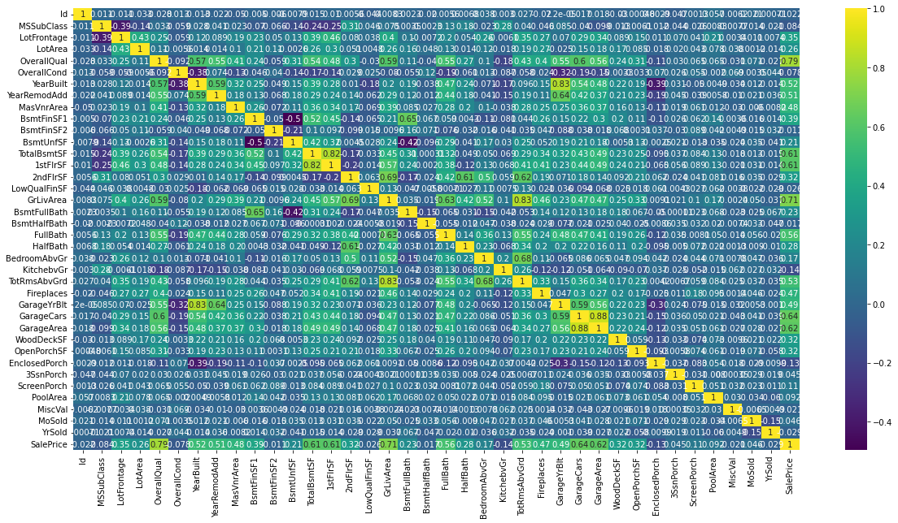
    


```python
#saleprice correlation matrix
k = 10 #number of variables for heatmap
cols = proj1.corr().nlargest(k, 'SalePrice')['SalePrice'].index
cm = proj1[cols].corr()
plt.figure(figsize=(10,6))
sns.heatmap(cm, annot=True, cmap = 'viridis')
```


    <AxesSubplot:>


    
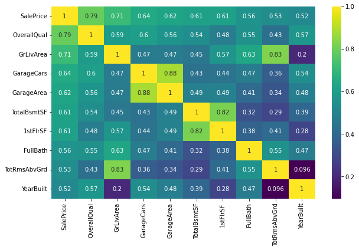
    


### d.	Pair plot for distribution and density


```python
num_cols = ['YearBuilt', 'GarageCars', 'FullBath', 'SalePrice']
for i in range(0,len(num_cols),2):
    plt.figure(figsize=(10,4))
    plt.subplot(121)
    sns.distplot(proj1[num_cols[i]], kde=False)
    plt.subplot(122)
    sns.distplot(proj1[num_cols[i+1]], kde=False)
    plt.tight_layout()
    plt.show()
```


    
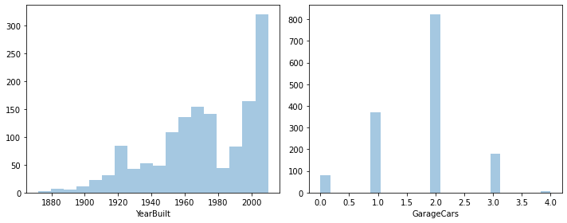
    


    
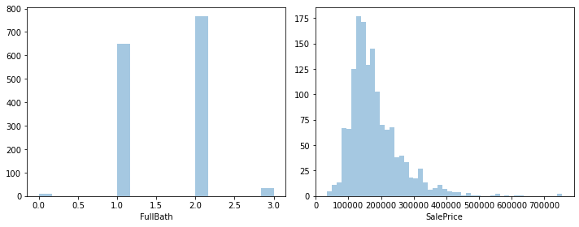
    


```python
num_cols = ['YearBuilt', 'GarageCars', 'FullBath', 'SalePrice']
for i in range(0,len(num_cols),2):
    plt.figure(figsize=(10,4))
    plt.subplot(121)
    sns.distplot(proj1[num_cols[i]], hist=True, kde=True)
    plt.subplot(122)
    sns.distplot(proj1[num_cols[i+1]], hist=True, kde=True)
    plt.tight_layout()
    plt.show()
```

    C:\ProgramData\Anaconda3\lib\site-packages\seaborn\distributions.py:2619: FutureWarning: `distplot` is a deprecated function and will be removed in a future version. Please adapt your code to use either `displot` (a figure-level function with similar flexibility) or `histplot` (an axes-level function for histograms).
      warnings.warn(msg, FutureWarning)
    


    
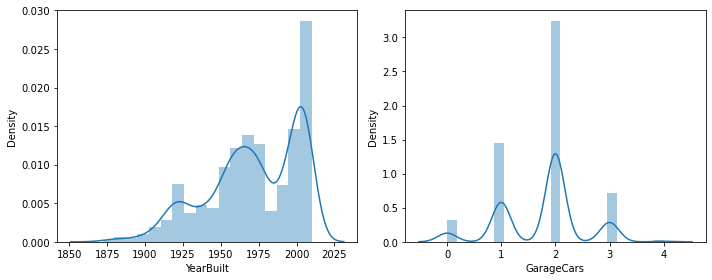
    


    C:\ProgramData\Anaconda3\lib\site-packages\seaborn\distributions.py:2619: FutureWarning: `distplot` is a deprecated function and will be removed in a future version. Please adapt your code to use either `displot` (a figure-level function with similar flexibility) or `histplot` (an axes-level function for histograms).
      warnings.warn(msg, FutureWarning)
    C:\ProgramData\Anaconda3\lib\site-packages\seaborn\distributions.py:2619: FutureWarning: `distplot` is a deprecated function and will be removed in a future version. Please adapt your code to use either `displot` (a figure-level function with similar flexibility) or `histplot` (an axes-level function for histograms).
      warnings.warn(msg, FutureWarning)
    


    
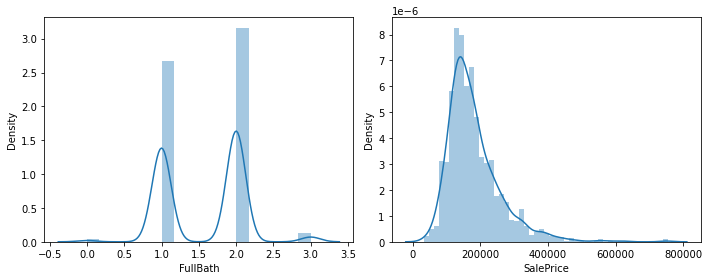
    


# 4.	EDA of categorical variables

### a.	Missing value treatment


```python
# check if there is a missing value in the data
categorical.isna().any()
```


    MSZoning         False
    Street           False
    Alley             True
    LotShape         False
    LandContour      False
    Utilities        False
    LotConfig        False
    LandSlope        False
    Neighborhood     False
    Condition1       False
    Condition2       False
    BldgType         False
    HouseStyle       False
    RoofStyle        False
    RoofMatl         False
    Exterior1st      False
    Exterior2nd      False
    MasVnrType        True
    ExterQual        False
    ExterCond        False
    Foundation       False
    BsmtQual          True
    BsmtCond          True
    BsmtExposure      True
    BsmtFinType1      True
    BsmtFinType2      True
    Heating          False
    HeatingQC        False
    CentralAir       False
    Electrical        True
    KitchenQual      False
    Functiol         False
    FireplaceQu       True
    GarageType        True
    GarageFinish      True
    GarageQual        True
    GarageCond        True
    PavedDrive       False
    PoolQC            True
    Fence             True
    MiscFeature       True
    SaleType         False
    SaleCondition    False
    dtype: bool


```python
categorical.isna().sum()*100/proj1.shape[0]
```


    MSZoning          0.000000
    Street            0.000000
    Alley            93.767123
    LotShape          0.000000
    LandContour       0.000000
    Utilities         0.000000
    LotConfig         0.000000
    LandSlope         0.000000
    Neighborhood      0.000000
    Condition1        0.000000
    Condition2        0.000000
    BldgType          0.000000
    HouseStyle        0.000000
    RoofStyle         0.000000
    RoofMatl          0.000000
    Exterior1st       0.000000
    Exterior2nd       0.000000
    MasVnrType        0.547945
    ExterQual         0.000000
    ExterCond         0.000000
    Foundation        0.000000
    BsmtQual          2.534247
    BsmtCond          2.534247
    BsmtExposure      2.602740
    BsmtFinType1      2.534247
    BsmtFinType2      2.602740
    Heating           0.000000
    HeatingQC         0.000000
    CentralAir        0.000000
    Electrical        0.068493
    KitchenQual       0.000000
    Functiol          0.000000
    FireplaceQu      47.260274
    GarageType        5.547945
    GarageFinish      5.547945
    GarageQual        5.547945
    GarageCond        5.547945
    PavedDrive        0.000000
    PoolQC           99.520548
    Fence            80.753425
    MiscFeature      96.301370
    SaleType          0.000000
    SaleCondition     0.000000
    dtype: float64


```python
categorical.shape
```


    (1460, 43)


```python
# dropping the rows where we have a missing value
categorical_cleaned=numerical.dropna()
```


```python
categorical_cleaned.shape
```


    (1121, 38)


```python
categorical.describe()
```


<div>
<style scoped>
    .dataframe tbody tr th:only-of-type {
        vertical-align: middle;
    }

    .dataframe tbody tr th {
        vertical-align: top;
    }

    .dataframe thead th {
        text-align: right;
    }
</style>
<table border="1" class="dataframe">
  <thead>
    <tr style="text-align: right;">
      <th></th>
      <th>MSZoning</th>
      <th>Street</th>
      <th>Alley</th>
      <th>LotShape</th>
      <th>LandContour</th>
      <th>Utilities</th>
      <th>LotConfig</th>
      <th>LandSlope</th>
      <th>Neighborhood</th>
      <th>Condition1</th>
      <th>...</th>
      <th>GarageType</th>
      <th>GarageFinish</th>
      <th>GarageQual</th>
      <th>GarageCond</th>
      <th>PavedDrive</th>
      <th>PoolQC</th>
      <th>Fence</th>
      <th>MiscFeature</th>
      <th>SaleType</th>
      <th>SaleCondition</th>
    </tr>
  </thead>
  <tbody>
    <tr>
      <th>count</th>
      <td>1460</td>
      <td>1460</td>
      <td>91</td>
      <td>1460</td>
      <td>1460</td>
      <td>1460</td>
      <td>1460</td>
      <td>1460</td>
      <td>1460</td>
      <td>1460</td>
      <td>...</td>
      <td>1379</td>
      <td>1379</td>
      <td>1379</td>
      <td>1379</td>
      <td>1460</td>
      <td>7</td>
      <td>281</td>
      <td>54</td>
      <td>1460</td>
      <td>1460</td>
    </tr>
    <tr>
      <th>unique</th>
      <td>5</td>
      <td>2</td>
      <td>2</td>
      <td>4</td>
      <td>4</td>
      <td>2</td>
      <td>5</td>
      <td>3</td>
      <td>25</td>
      <td>9</td>
      <td>...</td>
      <td>6</td>
      <td>3</td>
      <td>5</td>
      <td>5</td>
      <td>3</td>
      <td>3</td>
      <td>4</td>
      <td>4</td>
      <td>9</td>
      <td>6</td>
    </tr>
    <tr>
      <th>top</th>
      <td>RL</td>
      <td>Pave</td>
      <td>Grvl</td>
      <td>Reg</td>
      <td>Lvl</td>
      <td>AllPub</td>
      <td>Inside</td>
      <td>Gtl</td>
      <td>mes</td>
      <td>Norm</td>
      <td>...</td>
      <td>Attchd</td>
      <td>Unf</td>
      <td>TA</td>
      <td>TA</td>
      <td>Y</td>
      <td>Gd</td>
      <td>MnPrv</td>
      <td>Shed</td>
      <td>WD</td>
      <td>Normal</td>
    </tr>
    <tr>
      <th>freq</th>
      <td>1151</td>
      <td>1454</td>
      <td>50</td>
      <td>925</td>
      <td>1311</td>
      <td>1459</td>
      <td>1052</td>
      <td>1382</td>
      <td>225</td>
      <td>1260</td>
      <td>...</td>
      <td>870</td>
      <td>605</td>
      <td>1311</td>
      <td>1326</td>
      <td>1340</td>
      <td>3</td>
      <td>157</td>
      <td>49</td>
      <td>1267</td>
      <td>1198</td>
    </tr>
  </tbody>
</table>
<p>4 rows × 43 columns</p>
</div>


### b.	Count plot and box plot for bivariate analysis


```python

```


```python
#Countplot for Categorical Feature 'SaleCondition'
plt.figure(figsize=(15,5))
sns.countplot('SaleCondition', data=proj1)
```

    C:\ProgramData\Anaconda3\lib\site-packages\seaborn\_decorators.py:36: FutureWarning: Pass the following variable as a keyword arg: x. From version 0.12, the only valid positional argument will be `data`, and passing other arguments without an explicit keyword will result in an error or misinterpretation.
      warnings.warn(
    


    <AxesSubplot:xlabel='SaleCondition', ylabel='count'>


    
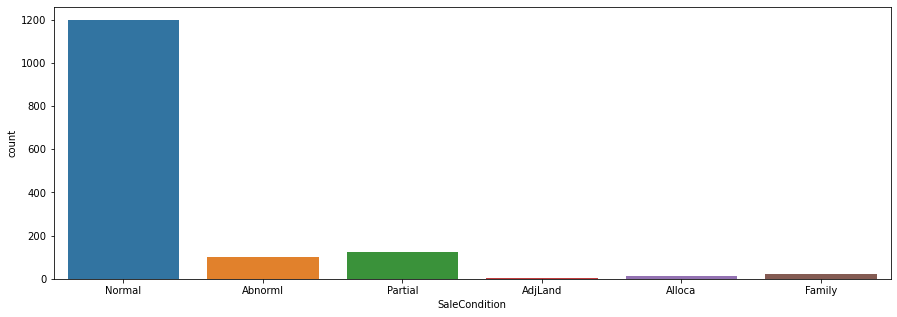
    


```python
sns.lmplot('GrLivArea', 'SalePrice', data=proj1, fit_reg=True)
```

    C:\ProgramData\Anaconda3\lib\site-packages\seaborn\_decorators.py:36: FutureWarning: Pass the following variables as keyword args: x, y. From version 0.12, the only valid positional argument will be `data`, and passing other arguments without an explicit keyword will result in an error or misinterpretation.
      warnings.warn(
    


    <seaborn.axisgrid.FacetGrid at 0x2525a0be5b0>


    
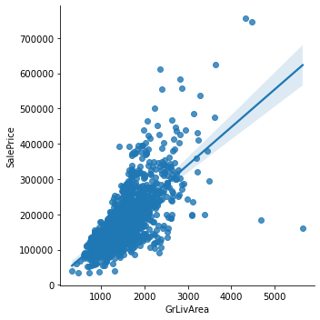
    


### Countplot For Categorical Feature 'Neighborhood' 


```python
plt.figure(figsize=(18,8))
sns.countplot(y='Neighborhood', data=proj1)
```


    <AxesSubplot:xlabel='count', ylabel='Neighborhood'>


    
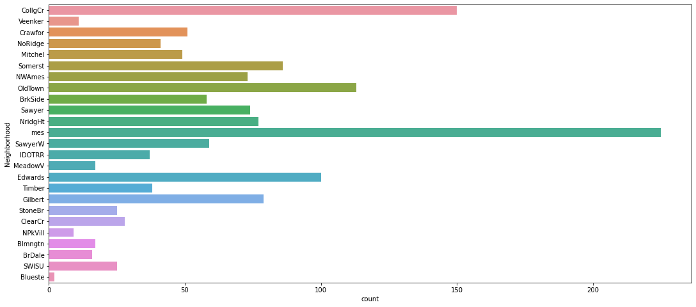
    


### c.	Identify significant variables using p-values and Chi-Square values
#### If the p-value obtained is:

- 0.05 (the α value you have chosen) you reject the H₀ (Null Hypothesis) and accept the H₁ (Alternate Hypothesis). This means the two categorical variables are dependent.
-  0.05 you accept the H₀ (Null Hypothesis) and reject the H₁ (Alternate Hypothesis). This means the two categorical variables are independent.


```python
proj1.head() 
```


<div>
<style scoped>
    .dataframe tbody tr th:only-of-type {
        vertical-align: middle;
    }

    .dataframe tbody tr th {
        vertical-align: top;
    }

    .dataframe thead th {
        text-align: right;
    }
</style>
<table border="1" class="dataframe">
  <thead>
    <tr style="text-align: right;">
      <th></th>
      <th>Id</th>
      <th>MSSubClass</th>
      <th>MSZoning</th>
      <th>LotFrontage</th>
      <th>LotArea</th>
      <th>Street</th>
      <th>Alley</th>
      <th>LotShape</th>
      <th>LandContour</th>
      <th>Utilities</th>
      <th>...</th>
      <th>PoolArea</th>
      <th>PoolQC</th>
      <th>Fence</th>
      <th>MiscFeature</th>
      <th>MiscVal</th>
      <th>MoSold</th>
      <th>YrSold</th>
      <th>SaleType</th>
      <th>SaleCondition</th>
      <th>SalePrice</th>
    </tr>
  </thead>
  <tbody>
    <tr>
      <th>0</th>
      <td>1</td>
      <td>60</td>
      <td>RL</td>
      <td>65.0</td>
      <td>8450</td>
      <td>Pave</td>
      <td>NaN</td>
      <td>Reg</td>
      <td>Lvl</td>
      <td>AllPub</td>
      <td>...</td>
      <td>0</td>
      <td>NaN</td>
      <td>NaN</td>
      <td>NaN</td>
      <td>0</td>
      <td>2</td>
      <td>2008</td>
      <td>WD</td>
      <td>Normal</td>
      <td>208500</td>
    </tr>
    <tr>
      <th>1</th>
      <td>2</td>
      <td>20</td>
      <td>RL</td>
      <td>80.0</td>
      <td>9600</td>
      <td>Pave</td>
      <td>NaN</td>
      <td>Reg</td>
      <td>Lvl</td>
      <td>AllPub</td>
      <td>...</td>
      <td>0</td>
      <td>NaN</td>
      <td>NaN</td>
      <td>NaN</td>
      <td>0</td>
      <td>5</td>
      <td>2007</td>
      <td>WD</td>
      <td>Normal</td>
      <td>181500</td>
    </tr>
    <tr>
      <th>2</th>
      <td>3</td>
      <td>60</td>
      <td>RL</td>
      <td>68.0</td>
      <td>11250</td>
      <td>Pave</td>
      <td>NaN</td>
      <td>IR1</td>
      <td>Lvl</td>
      <td>AllPub</td>
      <td>...</td>
      <td>0</td>
      <td>NaN</td>
      <td>NaN</td>
      <td>NaN</td>
      <td>0</td>
      <td>9</td>
      <td>2008</td>
      <td>WD</td>
      <td>Normal</td>
      <td>223500</td>
    </tr>
    <tr>
      <th>3</th>
      <td>4</td>
      <td>70</td>
      <td>RL</td>
      <td>60.0</td>
      <td>9550</td>
      <td>Pave</td>
      <td>NaN</td>
      <td>IR1</td>
      <td>Lvl</td>
      <td>AllPub</td>
      <td>...</td>
      <td>0</td>
      <td>NaN</td>
      <td>NaN</td>
      <td>NaN</td>
      <td>0</td>
      <td>2</td>
      <td>2006</td>
      <td>WD</td>
      <td>Abnorml</td>
      <td>140000</td>
    </tr>
    <tr>
      <th>4</th>
      <td>5</td>
      <td>60</td>
      <td>RL</td>
      <td>84.0</td>
      <td>14260</td>
      <td>Pave</td>
      <td>NaN</td>
      <td>IR1</td>
      <td>Lvl</td>
      <td>AllPub</td>
      <td>...</td>
      <td>0</td>
      <td>NaN</td>
      <td>NaN</td>
      <td>NaN</td>
      <td>0</td>
      <td>12</td>
      <td>2008</td>
      <td>WD</td>
      <td>Normal</td>
      <td>250000</td>
    </tr>
  </tbody>
</table>
<p>5 rows × 81 columns</p>
</div>


```python
proj1.info()
```

    <class 'pandas.core.frame.DataFrame'>
    RangeIndex: 1460 entries, 0 to 1459
    Data columns (total 81 columns):
     #   Column         Non-Null Count  Dtype  
    ---  ------         --------------  -----  
     0   Id             1460 non-null   int64  
     1   MSSubClass     1460 non-null   int64  
     2   MSZoning       1460 non-null   object 
     3   LotFrontage    1201 non-null   float64
     4   LotArea        1460 non-null   int64  
     5   Street         1460 non-null   object 
     6   Alley          91 non-null     object 
     7   LotShape       1460 non-null   object 
     8   LandContour    1460 non-null   object 
     9   Utilities      1460 non-null   object 
     10  LotConfig      1460 non-null   object 
     11  LandSlope      1460 non-null   object 
     12  Neighborhood   1460 non-null   object 
     13  Condition1     1460 non-null   object 
     14  Condition2     1460 non-null   object 
     15  BldgType       1460 non-null   object 
     16  HouseStyle     1460 non-null   object 
     17  OverallQual    1460 non-null   int64  
     18  OverallCond    1460 non-null   int64  
     19  YearBuilt      1460 non-null   int64  
     20  YearRemodAdd   1460 non-null   int64  
     21  RoofStyle      1460 non-null   object 
     22  RoofMatl       1460 non-null   object 
     23  Exterior1st    1460 non-null   object 
     24  Exterior2nd    1460 non-null   object 
     25  MasVnrType     1452 non-null   object 
     26  MasVnrArea     1452 non-null   float64
     27  ExterQual      1460 non-null   object 
     28  ExterCond      1460 non-null   object 
     29  Foundation     1460 non-null   object 
     30  BsmtQual       1423 non-null   object 
     31  BsmtCond       1423 non-null   object 
     32  BsmtExposure   1422 non-null   object 
     33  BsmtFinType1   1423 non-null   object 
     34  BsmtFinSF1     1460 non-null   int64  
     35  BsmtFinType2   1422 non-null   object 
     36  BsmtFinSF2     1460 non-null   int64  
     37  BsmtUnfSF      1460 non-null   int64  
     38  TotalBsmtSF    1460 non-null   int64  
     39  Heating        1460 non-null   object 
     40  HeatingQC      1460 non-null   object 
     41  CentralAir     1460 non-null   object 
     42  Electrical     1459 non-null   object 
     43  1stFlrSF       1460 non-null   int64  
     44  2ndFlrSF       1460 non-null   int64  
     45  LowQualFinSF   1460 non-null   int64  
     46  GrLivArea      1460 non-null   int64  
     47  BsmtFullBath   1460 non-null   int64  
     48  BsmtHalfBath   1460 non-null   int64  
     49  FullBath       1460 non-null   int64  
     50  HalfBath       1460 non-null   int64  
     51  BedroomAbvGr   1460 non-null   int64  
     52  KitchebvGr     1460 non-null   int64  
     53  KitchenQual    1460 non-null   object 
     54  TotRmsAbvGrd   1460 non-null   int64  
     55  Functiol       1460 non-null   object 
     56  Fireplaces     1460 non-null   int64  
     57  FireplaceQu    770 non-null    object 
     58  GarageType     1379 non-null   object 
     59  GarageYrBlt    1379 non-null   float64
     60  GarageFinish   1379 non-null   object 
     61  GarageCars     1460 non-null   int64  
     62  GarageArea     1460 non-null   int64  
     63  GarageQual     1379 non-null   object 
     64  GarageCond     1379 non-null   object 
     65  PavedDrive     1460 non-null   object 
     66  WoodDeckSF     1460 non-null   int64  
     67  OpenPorchSF    1460 non-null   int64  
     68  EnclosedPorch  1460 non-null   int64  
     69  3SsnPorch      1460 non-null   int64  
     70  ScreenPorch    1460 non-null   int64  
     71  PoolArea       1460 non-null   int64  
     72  PoolQC         7 non-null      object 
     73  Fence          281 non-null    object 
     74  MiscFeature    54 non-null     object 
     75  MiscVal        1460 non-null   int64  
     76  MoSold         1460 non-null   int64  
     77  YrSold         1460 non-null   int64  
     78  SaleType       1460 non-null   object 
     79  SaleCondition  1460 non-null   object 
     80  SalePrice      1460 non-null   int64  
    dtypes: float64(3), int64(35), object(43)
    memory usage: 924.0+ KB
    


```python
import researchpy as rp
import scipy.stats as stats
```


```python
proj1.shape
```


    (1460, 81)


```python
#get the columne data types
proj1.dtypes
```


    Id                 int64
    MSSubClass         int64
    MSZoning          object
    LotFrontage      float64
    LotArea            int64
                      ...   
    MoSold             int64
    YrSold             int64
    SaleType          object
    SaleCondition     object
    SalePrice          int64
    Length: 81, dtype: object


```python
#Get a count of the empty values of reach column
proj1.isna().sum()
```


    Id                 0
    MSSubClass         0
    MSZoning           0
    LotFrontage      259
    LotArea            0
                    ... 
    MoSold             0
    YrSold             0
    SaleType           0
    SaleCondition      0
    SalePrice          0
    Length: 81, dtype: int64


```python
proj1.isnull().values.any() # check for any missing /null values in the data  TRUE 259 missing
```


    True


```python
#view statistic
proj1.describe()
```


<div>
<style scoped>
    .dataframe tbody tr th:only-of-type {
        vertical-align: middle;
    }

    .dataframe tbody tr th {
        vertical-align: top;
    }

    .dataframe thead th {
        text-align: right;
    }
</style>
<table border="1" class="dataframe">
  <thead>
    <tr style="text-align: right;">
      <th></th>
      <th>Id</th>
      <th>MSSubClass</th>
      <th>LotFrontage</th>
      <th>LotArea</th>
      <th>OverallQual</th>
      <th>OverallCond</th>
      <th>YearBuilt</th>
      <th>YearRemodAdd</th>
      <th>MasVnrArea</th>
      <th>BsmtFinSF1</th>
      <th>...</th>
      <th>WoodDeckSF</th>
      <th>OpenPorchSF</th>
      <th>EnclosedPorch</th>
      <th>3SsnPorch</th>
      <th>ScreenPorch</th>
      <th>PoolArea</th>
      <th>MiscVal</th>
      <th>MoSold</th>
      <th>YrSold</th>
      <th>SalePrice</th>
    </tr>
  </thead>
  <tbody>
    <tr>
      <th>count</th>
      <td>1460.000000</td>
      <td>1460.000000</td>
      <td>1201.000000</td>
      <td>1460.000000</td>
      <td>1460.000000</td>
      <td>1460.000000</td>
      <td>1460.000000</td>
      <td>1460.000000</td>
      <td>1452.000000</td>
      <td>1460.000000</td>
      <td>...</td>
      <td>1460.000000</td>
      <td>1460.000000</td>
      <td>1460.000000</td>
      <td>1460.000000</td>
      <td>1460.000000</td>
      <td>1460.000000</td>
      <td>1460.000000</td>
      <td>1460.000000</td>
      <td>1460.000000</td>
      <td>1460.000000</td>
    </tr>
    <tr>
      <th>mean</th>
      <td>730.500000</td>
      <td>56.897260</td>
      <td>70.049958</td>
      <td>10516.828082</td>
      <td>6.099315</td>
      <td>5.575342</td>
      <td>1971.267808</td>
      <td>1984.865753</td>
      <td>103.685262</td>
      <td>443.639726</td>
      <td>...</td>
      <td>94.244521</td>
      <td>46.660274</td>
      <td>21.954110</td>
      <td>3.409589</td>
      <td>15.060959</td>
      <td>2.758904</td>
      <td>43.489041</td>
      <td>6.321918</td>
      <td>2007.815753</td>
      <td>180921.195890</td>
    </tr>
    <tr>
      <th>std</th>
      <td>421.610009</td>
      <td>42.300571</td>
      <td>24.284752</td>
      <td>9981.264932</td>
      <td>1.382997</td>
      <td>1.112799</td>
      <td>30.202904</td>
      <td>20.645407</td>
      <td>181.066207</td>
      <td>456.098091</td>
      <td>...</td>
      <td>125.338794</td>
      <td>66.256028</td>
      <td>61.119149</td>
      <td>29.317331</td>
      <td>55.757415</td>
      <td>40.177307</td>
      <td>496.123024</td>
      <td>2.703626</td>
      <td>1.328095</td>
      <td>79442.502883</td>
    </tr>
    <tr>
      <th>min</th>
      <td>1.000000</td>
      <td>20.000000</td>
      <td>21.000000</td>
      <td>1300.000000</td>
      <td>1.000000</td>
      <td>1.000000</td>
      <td>1872.000000</td>
      <td>1950.000000</td>
      <td>0.000000</td>
      <td>0.000000</td>
      <td>...</td>
      <td>0.000000</td>
      <td>0.000000</td>
      <td>0.000000</td>
      <td>0.000000</td>
      <td>0.000000</td>
      <td>0.000000</td>
      <td>0.000000</td>
      <td>1.000000</td>
      <td>2006.000000</td>
      <td>34900.000000</td>
    </tr>
    <tr>
      <th>25%</th>
      <td>365.750000</td>
      <td>20.000000</td>
      <td>59.000000</td>
      <td>7553.500000</td>
      <td>5.000000</td>
      <td>5.000000</td>
      <td>1954.000000</td>
      <td>1967.000000</td>
      <td>0.000000</td>
      <td>0.000000</td>
      <td>...</td>
      <td>0.000000</td>
      <td>0.000000</td>
      <td>0.000000</td>
      <td>0.000000</td>
      <td>0.000000</td>
      <td>0.000000</td>
      <td>0.000000</td>
      <td>5.000000</td>
      <td>2007.000000</td>
      <td>129975.000000</td>
    </tr>
    <tr>
      <th>50%</th>
      <td>730.500000</td>
      <td>50.000000</td>
      <td>69.000000</td>
      <td>9478.500000</td>
      <td>6.000000</td>
      <td>5.000000</td>
      <td>1973.000000</td>
      <td>1994.000000</td>
      <td>0.000000</td>
      <td>383.500000</td>
      <td>...</td>
      <td>0.000000</td>
      <td>25.000000</td>
      <td>0.000000</td>
      <td>0.000000</td>
      <td>0.000000</td>
      <td>0.000000</td>
      <td>0.000000</td>
      <td>6.000000</td>
      <td>2008.000000</td>
      <td>163000.000000</td>
    </tr>
    <tr>
      <th>75%</th>
      <td>1095.250000</td>
      <td>70.000000</td>
      <td>80.000000</td>
      <td>11601.500000</td>
      <td>7.000000</td>
      <td>6.000000</td>
      <td>2000.000000</td>
      <td>2004.000000</td>
      <td>166.000000</td>
      <td>712.250000</td>
      <td>...</td>
      <td>168.000000</td>
      <td>68.000000</td>
      <td>0.000000</td>
      <td>0.000000</td>
      <td>0.000000</td>
      <td>0.000000</td>
      <td>0.000000</td>
      <td>8.000000</td>
      <td>2009.000000</td>
      <td>214000.000000</td>
    </tr>
    <tr>
      <th>max</th>
      <td>1460.000000</td>
      <td>190.000000</td>
      <td>313.000000</td>
      <td>215245.000000</td>
      <td>10.000000</td>
      <td>9.000000</td>
      <td>2010.000000</td>
      <td>2010.000000</td>
      <td>1600.000000</td>
      <td>5644.000000</td>
      <td>...</td>
      <td>857.000000</td>
      <td>547.000000</td>
      <td>552.000000</td>
      <td>508.000000</td>
      <td>480.000000</td>
      <td>738.000000</td>
      <td>15500.000000</td>
      <td>12.000000</td>
      <td>2010.000000</td>
      <td>755000.000000</td>
    </tr>
  </tbody>
</table>
<p>8 rows × 38 columns</p>
</div>


```python
# Null Hypothesis: Neighborhood and SaleProice are independent of each other
# Alternative Hypotheis : They are related.
# p-value <0.05 then we will reject the Null Hypothesis.
```


```python
    proj1['MoSold'].value_counts()
```


    6     253
    7     234
    5     204
    4     141
    8     122
    3     106
    10     89
    11     79
    9      63
    12     59
    1      58
    2      52
    Name: MoSold, dtype: int64


```python
rp.summary_cat(proj1[["MoSold", "SalePrice"]])
```


```python
from scipy import stats
```


```python
stats.chi2_contingency(pd.crosstab(proj1.Neighborhood,proj1.SalePrice))
```


    (16898.75578956907,
     1.364960102688296e-08,
     15888,
     array([[0.01164384, 0.01164384, 0.01164384, ..., 0.01164384, 0.01164384,
             0.01164384],
            [0.00136986, 0.00136986, 0.00136986, ..., 0.00136986, 0.00136986,
             0.00136986],
            [0.0109589 , 0.0109589 , 0.0109589 , ..., 0.0109589 , 0.0109589 ,
             0.0109589 ],
            ...,
            [0.0260274 , 0.0260274 , 0.0260274 , ..., 0.0260274 , 0.0260274 ,
             0.0260274 ],
            [0.00753425, 0.00753425, 0.00753425, ..., 0.00753425, 0.00753425,
             0.00753425],
            [0.15410959, 0.15410959, 0.15410959, ..., 0.15410959, 0.15410959,
             0.15410959]]))


```python
# Null Hypothesis: MoSold and SaleProice are independetn of each other
crosstab = pd.crosstab(proj1["MoSold"], proj1["SalePrice"])
crosstab

```


<div>
<style scoped>
    .dataframe tbody tr th:only-of-type {
        vertical-align: middle;
    }

    .dataframe tbody tr th {
        vertical-align: top;
    }

    .dataframe thead th {
        text-align: right;
    }
</style>
<table border="1" class="dataframe">
  <thead>
    <tr style="text-align: right;">
      <th>SalePrice</th>
      <th>34900</th>
      <th>35311</th>
      <th>37900</th>
      <th>39300</th>
      <th>40000</th>
      <th>52000</th>
      <th>52500</th>
      <th>55000</th>
      <th>55993</th>
      <th>58500</th>
      <th>...</th>
      <th>485000</th>
      <th>501837</th>
      <th>538000</th>
      <th>555000</th>
      <th>556581</th>
      <th>582933</th>
      <th>611657</th>
      <th>625000</th>
      <th>745000</th>
      <th>755000</th>
    </tr>
    <tr>
      <th>MoSold</th>
      <th></th>
      <th></th>
      <th></th>
      <th></th>
      <th></th>
      <th></th>
      <th></th>
      <th></th>
      <th></th>
      <th></th>
      <th></th>
      <th></th>
      <th></th>
      <th></th>
      <th></th>
      <th></th>
      <th></th>
      <th></th>
      <th></th>
      <th></th>
      <th></th>
    </tr>
  </thead>
  <tbody>
    <tr>
      <th>1</th>
      <td>0</td>
      <td>0</td>
      <td>0</td>
      <td>1</td>
      <td>0</td>
      <td>0</td>
      <td>0</td>
      <td>1</td>
      <td>0</td>
      <td>0</td>
      <td>...</td>
      <td>0</td>
      <td>0</td>
      <td>0</td>
      <td>0</td>
      <td>0</td>
      <td>1</td>
      <td>0</td>
      <td>0</td>
      <td>0</td>
      <td>1</td>
    </tr>
    <tr>
      <th>2</th>
      <td>0</td>
      <td>0</td>
      <td>0</td>
      <td>0</td>
      <td>0</td>
      <td>0</td>
      <td>0</td>
      <td>0</td>
      <td>0</td>
      <td>0</td>
      <td>...</td>
      <td>0</td>
      <td>0</td>
      <td>0</td>
      <td>0</td>
      <td>0</td>
      <td>0</td>
      <td>0</td>
      <td>0</td>
      <td>0</td>
      <td>0</td>
    </tr>
    <tr>
      <th>3</th>
      <td>0</td>
      <td>0</td>
      <td>0</td>
      <td>0</td>
      <td>0</td>
      <td>0</td>
      <td>1</td>
      <td>0</td>
      <td>0</td>
      <td>0</td>
      <td>...</td>
      <td>0</td>
      <td>0</td>
      <td>0</td>
      <td>0</td>
      <td>0</td>
      <td>0</td>
      <td>1</td>
      <td>0</td>
      <td>0</td>
      <td>0</td>
    </tr>
    <tr>
      <th>4</th>
      <td>0</td>
      <td>0</td>
      <td>0</td>
      <td>0</td>
      <td>0</td>
      <td>0</td>
      <td>0</td>
      <td>0</td>
      <td>0</td>
      <td>0</td>
      <td>...</td>
      <td>0</td>
      <td>0</td>
      <td>0</td>
      <td>1</td>
      <td>0</td>
      <td>0</td>
      <td>0</td>
      <td>0</td>
      <td>0</td>
      <td>0</td>
    </tr>
    <tr>
      <th>5</th>
      <td>0</td>
      <td>0</td>
      <td>1</td>
      <td>0</td>
      <td>0</td>
      <td>0</td>
      <td>0</td>
      <td>0</td>
      <td>0</td>
      <td>0</td>
      <td>...</td>
      <td>0</td>
      <td>0</td>
      <td>0</td>
      <td>0</td>
      <td>0</td>
      <td>0</td>
      <td>0</td>
      <td>0</td>
      <td>0</td>
      <td>0</td>
    </tr>
    <tr>
      <th>6</th>
      <td>0</td>
      <td>0</td>
      <td>0</td>
      <td>0</td>
      <td>0</td>
      <td>0</td>
      <td>0</td>
      <td>0</td>
      <td>1</td>
      <td>1</td>
      <td>...</td>
      <td>0</td>
      <td>0</td>
      <td>1</td>
      <td>0</td>
      <td>0</td>
      <td>0</td>
      <td>0</td>
      <td>0</td>
      <td>0</td>
      <td>0</td>
    </tr>
    <tr>
      <th>7</th>
      <td>0</td>
      <td>0</td>
      <td>0</td>
      <td>0</td>
      <td>1</td>
      <td>1</td>
      <td>0</td>
      <td>1</td>
      <td>0</td>
      <td>0</td>
      <td>...</td>
      <td>1</td>
      <td>1</td>
      <td>0</td>
      <td>0</td>
      <td>1</td>
      <td>0</td>
      <td>0</td>
      <td>1</td>
      <td>1</td>
      <td>0</td>
    </tr>
    <tr>
      <th>8</th>
      <td>0</td>
      <td>0</td>
      <td>0</td>
      <td>0</td>
      <td>0</td>
      <td>0</td>
      <td>0</td>
      <td>0</td>
      <td>0</td>
      <td>0</td>
      <td>...</td>
      <td>0</td>
      <td>0</td>
      <td>0</td>
      <td>0</td>
      <td>0</td>
      <td>0</td>
      <td>0</td>
      <td>0</td>
      <td>0</td>
      <td>0</td>
    </tr>
    <tr>
      <th>9</th>
      <td>0</td>
      <td>0</td>
      <td>0</td>
      <td>0</td>
      <td>0</td>
      <td>0</td>
      <td>0</td>
      <td>0</td>
      <td>0</td>
      <td>0</td>
      <td>...</td>
      <td>0</td>
      <td>0</td>
      <td>0</td>
      <td>0</td>
      <td>0</td>
      <td>0</td>
      <td>0</td>
      <td>0</td>
      <td>0</td>
      <td>0</td>
    </tr>
    <tr>
      <th>10</th>
      <td>0</td>
      <td>1</td>
      <td>0</td>
      <td>0</td>
      <td>0</td>
      <td>0</td>
      <td>0</td>
      <td>0</td>
      <td>0</td>
      <td>0</td>
      <td>...</td>
      <td>0</td>
      <td>0</td>
      <td>0</td>
      <td>0</td>
      <td>0</td>
      <td>0</td>
      <td>0</td>
      <td>0</td>
      <td>0</td>
      <td>0</td>
    </tr>
    <tr>
      <th>11</th>
      <td>1</td>
      <td>0</td>
      <td>0</td>
      <td>0</td>
      <td>0</td>
      <td>0</td>
      <td>0</td>
      <td>0</td>
      <td>0</td>
      <td>0</td>
      <td>...</td>
      <td>0</td>
      <td>0</td>
      <td>0</td>
      <td>0</td>
      <td>0</td>
      <td>0</td>
      <td>0</td>
      <td>0</td>
      <td>0</td>
      <td>0</td>
    </tr>
    <tr>
      <th>12</th>
      <td>0</td>
      <td>0</td>
      <td>0</td>
      <td>0</td>
      <td>0</td>
      <td>0</td>
      <td>0</td>
      <td>0</td>
      <td>0</td>
      <td>0</td>
      <td>...</td>
      <td>0</td>
      <td>0</td>
      <td>0</td>
      <td>0</td>
      <td>0</td>
      <td>0</td>
      <td>0</td>
      <td>0</td>
      <td>0</td>
      <td>0</td>
    </tr>
  </tbody>
</table>
<p>12 rows × 663 columns</p>
</div>


```python
#The first value (7411.523) is the Chi-square value, followed by the p-value (0.1417)
stats.chi2_contingency(crosstab)
```


    (7411.523854621517,
     0.14175022512631114,
     7282,
     array([[0.03972603, 0.03972603, 0.03972603, ..., 0.03972603, 0.03972603,
             0.03972603],
            [0.03561644, 0.03561644, 0.03561644, ..., 0.03561644, 0.03561644,
             0.03561644],
            [0.07260274, 0.07260274, 0.07260274, ..., 0.07260274, 0.07260274,
             0.07260274],
            ...,
            [0.0609589 , 0.0609589 , 0.0609589 , ..., 0.0609589 , 0.0609589 ,
             0.0609589 ],
            [0.05410959, 0.05410959, 0.05410959, ..., 0.05410959, 0.05410959,
             0.05410959],
            [0.04041096, 0.04041096, 0.04041096, ..., 0.04041096, 0.04041096,
             0.04041096]]))


```python
pd.crosstab(proj1.SalePrice, proj1.MoSold, margins=True)
```


<div>
<style scoped>
    .dataframe tbody tr th:only-of-type {
        vertical-align: middle;
    }

    .dataframe tbody tr th {
        vertical-align: top;
    }

    .dataframe thead th {
        text-align: right;
    }
</style>
<table border="1" class="dataframe">
  <thead>
    <tr style="text-align: right;">
      <th>MoSold</th>
      <th>1</th>
      <th>2</th>
      <th>3</th>
      <th>4</th>
      <th>5</th>
      <th>6</th>
      <th>7</th>
      <th>8</th>
      <th>9</th>
      <th>10</th>
      <th>11</th>
      <th>12</th>
      <th>All</th>
    </tr>
    <tr>
      <th>SalePrice</th>
      <th></th>
      <th></th>
      <th></th>
      <th></th>
      <th></th>
      <th></th>
      <th></th>
      <th></th>
      <th></th>
      <th></th>
      <th></th>
      <th></th>
      <th></th>
    </tr>
  </thead>
  <tbody>
    <tr>
      <th>34900</th>
      <td>0</td>
      <td>0</td>
      <td>0</td>
      <td>0</td>
      <td>0</td>
      <td>0</td>
      <td>0</td>
      <td>0</td>
      <td>0</td>
      <td>0</td>
      <td>1</td>
      <td>0</td>
      <td>1</td>
    </tr>
    <tr>
      <th>35311</th>
      <td>0</td>
      <td>0</td>
      <td>0</td>
      <td>0</td>
      <td>0</td>
      <td>0</td>
      <td>0</td>
      <td>0</td>
      <td>0</td>
      <td>1</td>
      <td>0</td>
      <td>0</td>
      <td>1</td>
    </tr>
    <tr>
      <th>37900</th>
      <td>0</td>
      <td>0</td>
      <td>0</td>
      <td>0</td>
      <td>1</td>
      <td>0</td>
      <td>0</td>
      <td>0</td>
      <td>0</td>
      <td>0</td>
      <td>0</td>
      <td>0</td>
      <td>1</td>
    </tr>
    <tr>
      <th>39300</th>
      <td>1</td>
      <td>0</td>
      <td>0</td>
      <td>0</td>
      <td>0</td>
      <td>0</td>
      <td>0</td>
      <td>0</td>
      <td>0</td>
      <td>0</td>
      <td>0</td>
      <td>0</td>
      <td>1</td>
    </tr>
    <tr>
      <th>40000</th>
      <td>0</td>
      <td>0</td>
      <td>0</td>
      <td>0</td>
      <td>0</td>
      <td>0</td>
      <td>1</td>
      <td>0</td>
      <td>0</td>
      <td>0</td>
      <td>0</td>
      <td>0</td>
      <td>1</td>
    </tr>
    <tr>
      <th>...</th>
      <td>...</td>
      <td>...</td>
      <td>...</td>
      <td>...</td>
      <td>...</td>
      <td>...</td>
      <td>...</td>
      <td>...</td>
      <td>...</td>
      <td>...</td>
      <td>...</td>
      <td>...</td>
      <td>...</td>
    </tr>
    <tr>
      <th>611657</th>
      <td>0</td>
      <td>0</td>
      <td>1</td>
      <td>0</td>
      <td>0</td>
      <td>0</td>
      <td>0</td>
      <td>0</td>
      <td>0</td>
      <td>0</td>
      <td>0</td>
      <td>0</td>
      <td>1</td>
    </tr>
    <tr>
      <th>625000</th>
      <td>0</td>
      <td>0</td>
      <td>0</td>
      <td>0</td>
      <td>0</td>
      <td>0</td>
      <td>1</td>
      <td>0</td>
      <td>0</td>
      <td>0</td>
      <td>0</td>
      <td>0</td>
      <td>1</td>
    </tr>
    <tr>
      <th>745000</th>
      <td>0</td>
      <td>0</td>
      <td>0</td>
      <td>0</td>
      <td>0</td>
      <td>0</td>
      <td>1</td>
      <td>0</td>
      <td>0</td>
      <td>0</td>
      <td>0</td>
      <td>0</td>
      <td>1</td>
    </tr>
    <tr>
      <th>755000</th>
      <td>1</td>
      <td>0</td>
      <td>0</td>
      <td>0</td>
      <td>0</td>
      <td>0</td>
      <td>0</td>
      <td>0</td>
      <td>0</td>
      <td>0</td>
      <td>0</td>
      <td>0</td>
      <td>1</td>
    </tr>
    <tr>
      <th>All</th>
      <td>58</td>
      <td>52</td>
      <td>106</td>
      <td>141</td>
      <td>204</td>
      <td>253</td>
      <td>234</td>
      <td>122</td>
      <td>63</td>
      <td>89</td>
      <td>79</td>
      <td>59</td>
      <td>1460</td>
    </tr>
  </tbody>
</table>
<p>664 rows × 13 columns</p>
</div>


```python
plt.figure(figsize=(10,5))
sns.countplot(proj1['MoSold'])
```

    C:\ProgramData\Anaconda3\lib\site-packages\seaborn\_decorators.py:36: FutureWarning: Pass the following variable as a keyword arg: x. From version 0.12, the only valid positional argument will be `data`, and passing other arguments without an explicit keyword will result in an error or misinterpretation.
      warnings.warn(
    


    <AxesSubplot:xlabel='MoSold', ylabel='count'>


    

    


# 5.	Combine all the significant categorical and numerical variables
### jointplot which gives a plethora of information in a single plot.
- Scatter Plot
- Regression line fit to the data.
- Histogram and KDE of individual variables.
- Pearson correlation and p value.


```python
p1=proj1[['Neighborhood','SalePrice']]
```


```python
p2=proj1[['LotFrontage','MoSold']]
```


```python
p1.head(1)
```


<div>
<style scoped>
    .dataframe tbody tr th:only-of-type {
        vertical-align: middle;
    }

    .dataframe tbody tr th {
        vertical-align: top;
    }

    .dataframe thead th {
        text-align: right;
    }
</style>
<table border="1" class="dataframe">
  <thead>
    <tr style="text-align: right;">
      <th></th>
      <th>Neighborhood</th>
      <th>SalePrice</th>
    </tr>
  </thead>
  <tbody>
    <tr>
      <th>0</th>
      <td>CollgCr</td>
      <td>208500</td>
    </tr>
  </tbody>
</table>
</div>


```python
p2.head(1)
```


<div>
<style scoped>
    .dataframe tbody tr th:only-of-type {
        vertical-align: middle;
    }

    .dataframe tbody tr th {
        vertical-align: top;
    }

    .dataframe thead th {
        text-align: right;
    }
</style>
<table border="1" class="dataframe">
  <thead>
    <tr style="text-align: right;">
      <th></th>
      <th>LotFrontage</th>
      <th>MoSold</th>
    </tr>
  </thead>
  <tbody>
    <tr>
      <th>0</th>
      <td>65.0</td>
      <td>2</td>
    </tr>
  </tbody>
</table>
</div>


```python
pd.concat([p1,p2], axis=1)
```


<div>
<style scoped>
    .dataframe tbody tr th:only-of-type {
        vertical-align: middle;
    }

    .dataframe tbody tr th {
        vertical-align: top;
    }

    .dataframe thead th {
        text-align: right;
    }
</style>
<table border="1" class="dataframe">
  <thead>
    <tr style="text-align: right;">
      <th></th>
      <th>Neighborhood</th>
      <th>SalePrice</th>
      <th>LotFrontage</th>
      <th>MoSold</th>
    </tr>
  </thead>
  <tbody>
    <tr>
      <th>0</th>
      <td>CollgCr</td>
      <td>208500</td>
      <td>65.0</td>
      <td>2</td>
    </tr>
    <tr>
      <th>1</th>
      <td>Veenker</td>
      <td>181500</td>
      <td>80.0</td>
      <td>5</td>
    </tr>
    <tr>
      <th>2</th>
      <td>CollgCr</td>
      <td>223500</td>
      <td>68.0</td>
      <td>9</td>
    </tr>
    <tr>
      <th>3</th>
      <td>Crawfor</td>
      <td>140000</td>
      <td>60.0</td>
      <td>2</td>
    </tr>
    <tr>
      <th>4</th>
      <td>NoRidge</td>
      <td>250000</td>
      <td>84.0</td>
      <td>12</td>
    </tr>
    <tr>
      <th>...</th>
      <td>...</td>
      <td>...</td>
      <td>...</td>
      <td>...</td>
    </tr>
    <tr>
      <th>1455</th>
      <td>Gilbert</td>
      <td>175000</td>
      <td>62.0</td>
      <td>8</td>
    </tr>
    <tr>
      <th>1456</th>
      <td>NWAmes</td>
      <td>210000</td>
      <td>85.0</td>
      <td>2</td>
    </tr>
    <tr>
      <th>1457</th>
      <td>Crawfor</td>
      <td>266500</td>
      <td>66.0</td>
      <td>5</td>
    </tr>
    <tr>
      <th>1458</th>
      <td>mes</td>
      <td>142125</td>
      <td>68.0</td>
      <td>4</td>
    </tr>
    <tr>
      <th>1459</th>
      <td>Edwards</td>
      <td>147500</td>
      <td>75.0</td>
      <td>6</td>
    </tr>
  </tbody>
</table>
<p>1460 rows × 4 columns</p>
</div>


```python
# Jointplot which gives a plethora of information in a single plot.
sns.jointplot('BedroomAbvGr', 'SalePrice', data=proj1, kind='reg')
```

    C:\ProgramData\Anaconda3\lib\site-packages\seaborn\_decorators.py:36: FutureWarning: Pass the following variables as keyword args: x, y. From version 0.12, the only valid positional argument will be `data`, and passing other arguments without an explicit keyword will result in an error or misinterpretation.
      warnings.warn(
    


    <seaborn.axisgrid.JointGrid at 0x2d594270550>


    
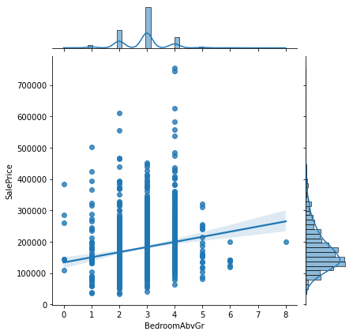
    


```python
sns.jointplot('YearBuilt', 'SalePrice', data=proj1, kind='hex')
```

    C:\ProgramData\Anaconda3\lib\site-packages\seaborn\_decorators.py:36: FutureWarning: Pass the following variables as keyword args: x, y. From version 0.12, the only valid positional argument will be `data`, and passing other arguments without an explicit keyword will result in an error or misinterpretation.
      warnings.warn(
    


    <seaborn.axisgrid.JointGrid at 0x2d5958ea460>


    
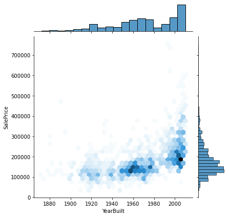
    


# 6.	Plot box plot for the new dataset to find the variables with outliers


```python
proj1.select_dtypes(['int', 'float'])
```


<div>
<style scoped>
    .dataframe tbody tr th:only-of-type {
        vertical-align: middle;
    }

    .dataframe tbody tr th {
        vertical-align: top;
    }

    .dataframe thead th {
        text-align: right;
    }
</style>
<table border="1" class="dataframe">
  <thead>
    <tr style="text-align: right;">
      <th></th>
      <th>Id</th>
      <th>MSSubClass</th>
      <th>LotFrontage</th>
      <th>LotArea</th>
      <th>OverallQual</th>
      <th>OverallCond</th>
      <th>YearBuilt</th>
      <th>YearRemodAdd</th>
      <th>MasVnrArea</th>
      <th>BsmtFinSF1</th>
      <th>...</th>
      <th>WoodDeckSF</th>
      <th>OpenPorchSF</th>
      <th>EnclosedPorch</th>
      <th>3SsnPorch</th>
      <th>ScreenPorch</th>
      <th>PoolArea</th>
      <th>MiscVal</th>
      <th>MoSold</th>
      <th>YrSold</th>
      <th>SalePrice</th>
    </tr>
  </thead>
  <tbody>
    <tr>
      <th>0</th>
      <td>1</td>
      <td>60</td>
      <td>65.0</td>
      <td>8450</td>
      <td>7</td>
      <td>5</td>
      <td>2003</td>
      <td>2003</td>
      <td>196.0</td>
      <td>706</td>
      <td>...</td>
      <td>0</td>
      <td>61</td>
      <td>0</td>
      <td>0</td>
      <td>0</td>
      <td>0</td>
      <td>0</td>
      <td>2</td>
      <td>2008</td>
      <td>208500</td>
    </tr>
    <tr>
      <th>1</th>
      <td>2</td>
      <td>20</td>
      <td>80.0</td>
      <td>9600</td>
      <td>6</td>
      <td>8</td>
      <td>1976</td>
      <td>1976</td>
      <td>0.0</td>
      <td>978</td>
      <td>...</td>
      <td>298</td>
      <td>0</td>
      <td>0</td>
      <td>0</td>
      <td>0</td>
      <td>0</td>
      <td>0</td>
      <td>5</td>
      <td>2007</td>
      <td>181500</td>
    </tr>
    <tr>
      <th>2</th>
      <td>3</td>
      <td>60</td>
      <td>68.0</td>
      <td>11250</td>
      <td>7</td>
      <td>5</td>
      <td>2001</td>
      <td>2002</td>
      <td>162.0</td>
      <td>486</td>
      <td>...</td>
      <td>0</td>
      <td>42</td>
      <td>0</td>
      <td>0</td>
      <td>0</td>
      <td>0</td>
      <td>0</td>
      <td>9</td>
      <td>2008</td>
      <td>223500</td>
    </tr>
    <tr>
      <th>3</th>
      <td>4</td>
      <td>70</td>
      <td>60.0</td>
      <td>9550</td>
      <td>7</td>
      <td>5</td>
      <td>1915</td>
      <td>1970</td>
      <td>0.0</td>
      <td>216</td>
      <td>...</td>
      <td>0</td>
      <td>35</td>
      <td>272</td>
      <td>0</td>
      <td>0</td>
      <td>0</td>
      <td>0</td>
      <td>2</td>
      <td>2006</td>
      <td>140000</td>
    </tr>
    <tr>
      <th>4</th>
      <td>5</td>
      <td>60</td>
      <td>84.0</td>
      <td>14260</td>
      <td>8</td>
      <td>5</td>
      <td>2000</td>
      <td>2000</td>
      <td>350.0</td>
      <td>655</td>
      <td>...</td>
      <td>192</td>
      <td>84</td>
      <td>0</td>
      <td>0</td>
      <td>0</td>
      <td>0</td>
      <td>0</td>
      <td>12</td>
      <td>2008</td>
      <td>250000</td>
    </tr>
    <tr>
      <th>...</th>
      <td>...</td>
      <td>...</td>
      <td>...</td>
      <td>...</td>
      <td>...</td>
      <td>...</td>
      <td>...</td>
      <td>...</td>
      <td>...</td>
      <td>...</td>
      <td>...</td>
      <td>...</td>
      <td>...</td>
      <td>...</td>
      <td>...</td>
      <td>...</td>
      <td>...</td>
      <td>...</td>
      <td>...</td>
      <td>...</td>
      <td>...</td>
    </tr>
    <tr>
      <th>1455</th>
      <td>1456</td>
      <td>60</td>
      <td>62.0</td>
      <td>7917</td>
      <td>6</td>
      <td>5</td>
      <td>1999</td>
      <td>2000</td>
      <td>0.0</td>
      <td>0</td>
      <td>...</td>
      <td>0</td>
      <td>40</td>
      <td>0</td>
      <td>0</td>
      <td>0</td>
      <td>0</td>
      <td>0</td>
      <td>8</td>
      <td>2007</td>
      <td>175000</td>
    </tr>
    <tr>
      <th>1456</th>
      <td>1457</td>
      <td>20</td>
      <td>85.0</td>
      <td>13175</td>
      <td>6</td>
      <td>6</td>
      <td>1978</td>
      <td>1988</td>
      <td>119.0</td>
      <td>790</td>
      <td>...</td>
      <td>349</td>
      <td>0</td>
      <td>0</td>
      <td>0</td>
      <td>0</td>
      <td>0</td>
      <td>0</td>
      <td>2</td>
      <td>2010</td>
      <td>210000</td>
    </tr>
    <tr>
      <th>1457</th>
      <td>1458</td>
      <td>70</td>
      <td>66.0</td>
      <td>9042</td>
      <td>7</td>
      <td>9</td>
      <td>1941</td>
      <td>2006</td>
      <td>0.0</td>
      <td>275</td>
      <td>...</td>
      <td>0</td>
      <td>60</td>
      <td>0</td>
      <td>0</td>
      <td>0</td>
      <td>0</td>
      <td>2500</td>
      <td>5</td>
      <td>2010</td>
      <td>266500</td>
    </tr>
    <tr>
      <th>1458</th>
      <td>1459</td>
      <td>20</td>
      <td>68.0</td>
      <td>9717</td>
      <td>5</td>
      <td>6</td>
      <td>1950</td>
      <td>1996</td>
      <td>0.0</td>
      <td>49</td>
      <td>...</td>
      <td>366</td>
      <td>0</td>
      <td>112</td>
      <td>0</td>
      <td>0</td>
      <td>0</td>
      <td>0</td>
      <td>4</td>
      <td>2010</td>
      <td>142125</td>
    </tr>
    <tr>
      <th>1459</th>
      <td>1460</td>
      <td>20</td>
      <td>75.0</td>
      <td>9937</td>
      <td>5</td>
      <td>6</td>
      <td>1965</td>
      <td>1965</td>
      <td>0.0</td>
      <td>830</td>
      <td>...</td>
      <td>736</td>
      <td>68</td>
      <td>0</td>
      <td>0</td>
      <td>0</td>
      <td>0</td>
      <td>0</td>
      <td>6</td>
      <td>2008</td>
      <td>147500</td>
    </tr>
  </tbody>
</table>
<p>1460 rows × 38 columns</p>
</div>


```python
proj1.columns
```


    Index(['Id', 'MSSubClass', 'MSZoning', 'LotFrontage', 'LotArea', 'Street',
           'Alley', 'LotShape', 'LandContour', 'Utilities', 'LotConfig',
           'LandSlope', 'Neighborhood', 'Condition1', 'Condition2', 'BldgType',
           'HouseStyle', 'OverallQual', 'OverallCond', 'YearBuilt', 'YearRemodAdd',
           'RoofStyle', 'RoofMatl', 'Exterior1st', 'Exterior2nd', 'MasVnrType',
           'MasVnrArea', 'ExterQual', 'ExterCond', 'Foundation', 'BsmtQual',
           'BsmtCond', 'BsmtExposure', 'BsmtFinType1', 'BsmtFinSF1',
           'BsmtFinType2', 'BsmtFinSF2', 'BsmtUnfSF', 'TotalBsmtSF', 'Heating',
           'HeatingQC', 'CentralAir', 'Electrical', '1stFlrSF', '2ndFlrSF',
           'LowQualFinSF', 'GrLivArea', 'BsmtFullBath', 'BsmtHalfBath', 'FullBath',
           'HalfBath', 'BedroomAbvGr', 'KitchebvGr', 'KitchenQual', 'TotRmsAbvGrd',
           'Functiol', 'Fireplaces', 'FireplaceQu', 'GarageType', 'GarageYrBlt',
           'GarageFinish', 'GarageCars', 'GarageArea', 'GarageQual', 'GarageCond',
           'PavedDrive', 'WoodDeckSF', 'OpenPorchSF', 'EnclosedPorch', '3SsnPorch',
           'ScreenPorch', 'PoolArea', 'PoolQC', 'Fence', 'MiscFeature', 'MiscVal',
           'MoSold', 'YrSold', 'SaleType', 'SaleCondition', 'SalePrice'],
          dtype='object')


```python
n=len(proj1.columns)
```


```python
n
```


    81


```python
n//2+1
```


    41


```python
plt.figure(figsize=(14,6))
sns.boxplot(data=proj1,x='SalePrice')
plt.show()
```


    
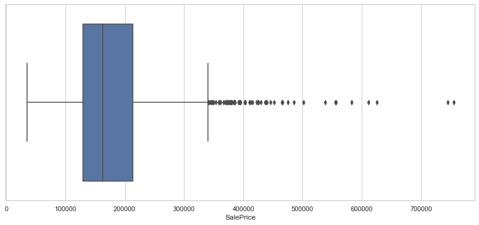
    


```python
plt.figure(figsize=(14,6))
sns.boxplot(data=proj1,y='SalePrice')
plt.show()
```


    
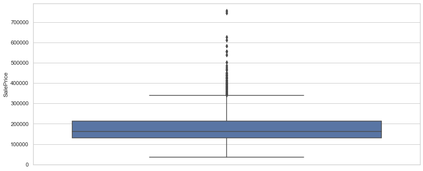
    


```python
plt.figure(figsize=(14,6))
sns.boxplot(data=proj1,x='OverallQual',y='SalePrice')
plt.show()
```


    
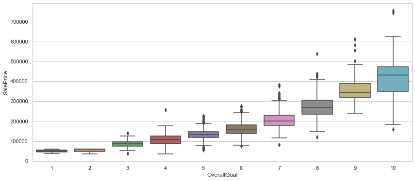
    


```python
plt.figure(figsize=(15,8))
plt.xticks(rotation = 45)
sns.boxplot('Neighborhood', 'SalePrice', data=proj1)
```

    C:\ProgramData\Anaconda3\lib\site-packages\seaborn\_decorators.py:36: FutureWarning: Pass the following variables as keyword args: x, y. From version 0.12, the only valid positional argument will be `data`, and passing other arguments without an explicit keyword will result in an error or misinterpretation.
      warnings.warn(
    


    <AxesSubplot:xlabel='Neighborhood', ylabel='SalePrice'>


    
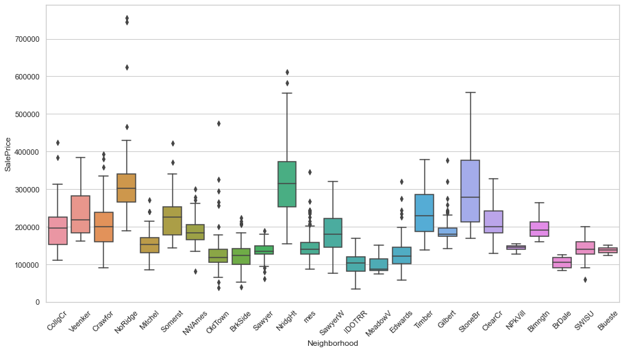
    


### Plot Boxplots for 'YearBuilt', 'FullBath', 'GrLivArea', and 'SalePrice' show some outliers, which are represented by dots.


```python
FullBathnum_cols = ['YearBuilt', 'FullBath', 'GrLivArea', 'SalePrice']
facet = None
for i in range(0,len(num_cols),2):
    plt.figure(figsize=(10,4))
    plt.subplot(121)
    sns.boxplot(facet, num_cols[i],data = proj1)
    plt.subplot(122)
    sns.boxplot(facet, num_cols[i+1],data = proj1)
    plt.tight_layout()
    plt.show()
```

    C:\ProgramData\Anaconda3\lib\site-packages\seaborn\_decorators.py:36: FutureWarning: Pass the following variables as keyword args: x, y. From version 0.12, the only valid positional argument will be `data`, and passing other arguments without an explicit keyword will result in an error or misinterpretation.
      warnings.warn(
    C:\ProgramData\Anaconda3\lib\site-packages\seaborn\_decorators.py:36: FutureWarning: Pass the following variables as keyword args: x, y. From version 0.12, the only valid positional argument will be `data`, and passing other arguments without an explicit keyword will result in an error or misinterpretation.
      warnings.warn(
    


    
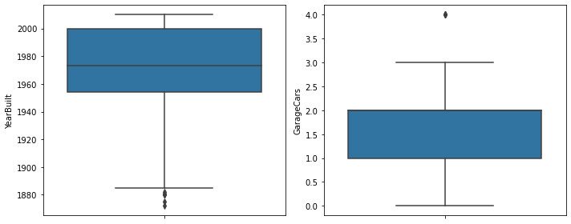
    


    C:\ProgramData\Anaconda3\lib\site-packages\seaborn\_decorators.py:36: FutureWarning: Pass the following variables as keyword args: x, y. From version 0.12, the only valid positional argument will be `data`, and passing other arguments without an explicit keyword will result in an error or misinterpretation.
      warnings.warn(
    C:\ProgramData\Anaconda3\lib\site-packages\seaborn\_decorators.py:36: FutureWarning: Pass the following variables as keyword args: x, y. From version 0.12, the only valid positional argument will be `data`, and passing other arguments without an explicit keyword will result in an error or misinterpretation.
      warnings.warn(
    


    
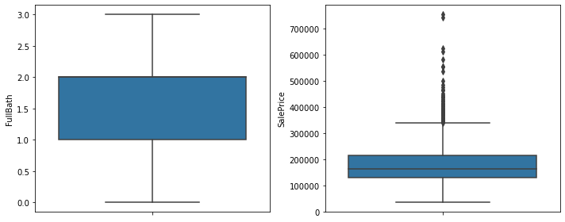
    


# Violin Plot
- Violin plots are similar to box plots, but they also display the data's probability density at different values.
- It is a numeric data plotting approach that combines the box and kernel density plots.
- It is more informative than a box plot.
- In general, while a box plot only displays summary statistics including mean, median, and interquartile ranges, a violin plot displays the
- entire data distribution.


```python
import seaborn as sns
sns.set(style="whitegrid")
f, ax = plt.subplots(figsize=(15, 10))
# Show each distribution with both violins and points
sns.violinplot(x="SaleCondition",y="SalePrice",data=proj1, inner="box", palette="Set3", cut=2, linewidth=3,
ax=ax)
sns.despine(left=True)
ax.set_title('SaleCondition vs. SalesPrice')
ax.set_xlabel("SaleCondition", alpha=0.7)
ax.set_ylabel("SalePrice", alpha=0.7)
```


    Text(0, 0.5, 'SalePrice')


    
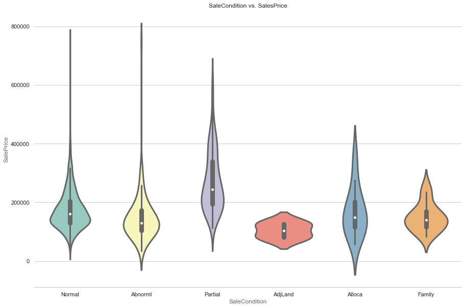
    


## Plot Histogram for 'YearBuilt', 'FullBath', 'GrLivArea', and 'SalePrice'


```python
num_cols = ['YearBuilt', 'FullBath', 'GrLivArea', 'SalePrice']
for i in range(0,len(num_cols),2):
    plt.figure(figsize=(10,4))
    plt.subplot(121)
    sns.distplot(proj1[num_cols[i]], kde=False)
    plt.subplot(122)
    sns.distplot(proj1[num_cols[i+1]], kde=False)
    plt.tight_layout()
    plt.show()
```

    C:\ProgramData\Anaconda3\lib\site-packages\seaborn\distributions.py:2619: FutureWarning: `distplot` is a deprecated function and will be removed in a future version. Please adapt your code to use either `displot` (a figure-level function with similar flexibility) or `histplot` (an axes-level function for histograms).
      warnings.warn(msg, FutureWarning)
    


    
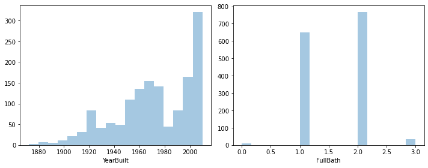
    


    
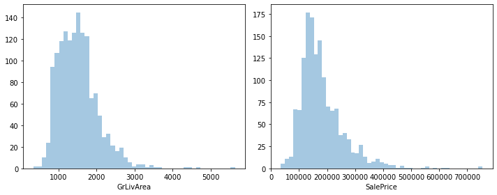
    


## Plot Kernel Density Function for 'YearBuilt', 'FullBath', 'GrLivArea', and 'SalePrice'


```python
num_cols = ['YearBuilt', 'FullBath', 'GrLivArea', 'SalePrice']
for i in range(0,len(num_cols),2):
    plt.figure(figsize=(10,4))
    plt.subplot(121)
    sns.distplot(proj1[num_cols[i]], hist=True, kde=True)
    plt.subplot(122)
    sns.distplot(proj1[num_cols[i+1]], hist=True, kde=True)
    plt.tight_layout()
    plt.show()
```

    C:\ProgramData\Anaconda3\lib\site-packages\seaborn\distributions.py:2619: FutureWarning: `distplot` is a deprecated function and will be removed in a future version. Please adapt your code to use either `displot` (a figure-level function with similar flexibility) or `histplot` (an axes-level function for histograms).
      warnings.warn(msg, FutureWarning)
    


    
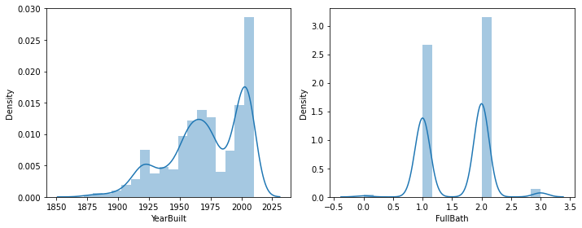
    


    C:\ProgramData\Anaconda3\lib\site-packages\seaborn\distributions.py:2619: FutureWarning: `distplot` is a deprecated function and will be removed in a future version. Please adapt your code to use either `displot` (a figure-level function with similar flexibility) or `histplot` (an axes-level function for histograms).
      warnings.warn(msg, FutureWarning)
    C:\ProgramData\Anaconda3\lib\site-packages\seaborn\distributions.py:2619: FutureWarning: `distplot` is a deprecated function and will be removed in a future version. Please adapt your code to use either `displot` (a figure-level function with similar flexibility) or `histplot` (an axes-level function for histograms).
      warnings.warn(msg, FutureWarning)
    


    
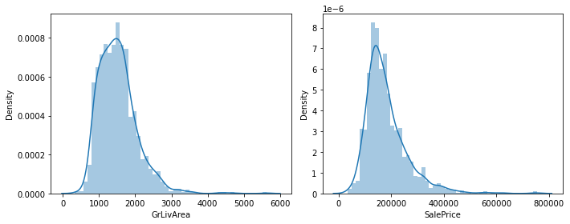
    


## Plot 'GarageCars' against 'SalePrice'


```python
#fig = plt.figure(figsize =(20, 5))
sns.lmplot('GarageCars', 'SalePrice', data=proj1, fit_reg=True)
```

    C:\ProgramData\Anaconda3\lib\site-packages\seaborn\_decorators.py:36: FutureWarning: Pass the following variables as keyword args: x, y. From version 0.12, the only valid positional argument will be `data`, and passing other arguments without an explicit keyword will result in an error or misinterpretation.
      warnings.warn(
    


    <seaborn.axisgrid.FacetGrid at 0x2d515034250>


    
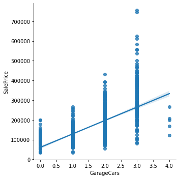
    


## Categorical vs. Categorical


```python
crosstab = pd.crosstab(index=proj1["Neighborhood"], columns=proj1["OverallQual"])
crosstab
```


<div>
<style scoped>
    .dataframe tbody tr th:only-of-type {
        vertical-align: middle;
    }

    .dataframe tbody tr th {
        vertical-align: top;
    }

    .dataframe thead th {
        text-align: right;
    }
</style>
<table border="1" class="dataframe">
  <thead>
    <tr style="text-align: right;">
      <th>OverallQual</th>
      <th>1</th>
      <th>2</th>
      <th>3</th>
      <th>4</th>
      <th>5</th>
      <th>6</th>
      <th>7</th>
      <th>8</th>
      <th>9</th>
      <th>10</th>
    </tr>
    <tr>
      <th>Neighborhood</th>
      <th></th>
      <th></th>
      <th></th>
      <th></th>
      <th></th>
      <th></th>
      <th></th>
      <th></th>
      <th></th>
      <th></th>
    </tr>
  </thead>
  <tbody>
    <tr>
      <th>Blmngtn</th>
      <td>0</td>
      <td>0</td>
      <td>0</td>
      <td>0</td>
      <td>0</td>
      <td>0</td>
      <td>14</td>
      <td>3</td>
      <td>0</td>
      <td>0</td>
    </tr>
    <tr>
      <th>Blueste</th>
      <td>0</td>
      <td>0</td>
      <td>0</td>
      <td>0</td>
      <td>0</td>
      <td>2</td>
      <td>0</td>
      <td>0</td>
      <td>0</td>
      <td>0</td>
    </tr>
    <tr>
      <th>BrDale</th>
      <td>0</td>
      <td>0</td>
      <td>0</td>
      <td>0</td>
      <td>5</td>
      <td>11</td>
      <td>0</td>
      <td>0</td>
      <td>0</td>
      <td>0</td>
    </tr>
    <tr>
      <th>BrkSide</th>
      <td>1</td>
      <td>1</td>
      <td>3</td>
      <td>10</td>
      <td>21</td>
      <td>18</td>
      <td>4</td>
      <td>0</td>
      <td>0</td>
      <td>0</td>
    </tr>
    <tr>
      <th>ClearCr</th>
      <td>0</td>
      <td>0</td>
      <td>0</td>
      <td>3</td>
      <td>6</td>
      <td>10</td>
      <td>9</td>
      <td>0</td>
      <td>0</td>
      <td>0</td>
    </tr>
    <tr>
      <th>CollgCr</th>
      <td>0</td>
      <td>0</td>
      <td>0</td>
      <td>1</td>
      <td>28</td>
      <td>24</td>
      <td>71</td>
      <td>23</td>
      <td>3</td>
      <td>0</td>
    </tr>
    <tr>
      <th>Crawfor</th>
      <td>0</td>
      <td>0</td>
      <td>0</td>
      <td>1</td>
      <td>11</td>
      <td>19</td>
      <td>13</td>
      <td>7</td>
      <td>0</td>
      <td>0</td>
    </tr>
    <tr>
      <th>Edwards</th>
      <td>1</td>
      <td>0</td>
      <td>5</td>
      <td>25</td>
      <td>38</td>
      <td>23</td>
      <td>5</td>
      <td>0</td>
      <td>1</td>
      <td>2</td>
    </tr>
    <tr>
      <th>Gilbert</th>
      <td>0</td>
      <td>0</td>
      <td>0</td>
      <td>1</td>
      <td>3</td>
      <td>33</td>
      <td>36</td>
      <td>5</td>
      <td>1</td>
      <td>0</td>
    </tr>
    <tr>
      <th>IDOTRR</th>
      <td>0</td>
      <td>1</td>
      <td>3</td>
      <td>12</td>
      <td>11</td>
      <td>8</td>
      <td>2</td>
      <td>0</td>
      <td>0</td>
      <td>0</td>
    </tr>
    <tr>
      <th>MeadowV</th>
      <td>0</td>
      <td>0</td>
      <td>0</td>
      <td>10</td>
      <td>6</td>
      <td>1</td>
      <td>0</td>
      <td>0</td>
      <td>0</td>
      <td>0</td>
    </tr>
    <tr>
      <th>Mitchel</th>
      <td>0</td>
      <td>0</td>
      <td>0</td>
      <td>3</td>
      <td>22</td>
      <td>17</td>
      <td>6</td>
      <td>1</td>
      <td>0</td>
      <td>0</td>
    </tr>
    <tr>
      <th>NPkVill</th>
      <td>0</td>
      <td>0</td>
      <td>0</td>
      <td>0</td>
      <td>0</td>
      <td>9</td>
      <td>0</td>
      <td>0</td>
      <td>0</td>
      <td>0</td>
    </tr>
    <tr>
      <th>NWAmes</th>
      <td>0</td>
      <td>0</td>
      <td>0</td>
      <td>0</td>
      <td>8</td>
      <td>36</td>
      <td>26</td>
      <td>3</td>
      <td>0</td>
      <td>0</td>
    </tr>
    <tr>
      <th>NoRidge</th>
      <td>0</td>
      <td>0</td>
      <td>0</td>
      <td>0</td>
      <td>0</td>
      <td>0</td>
      <td>12</td>
      <td>24</td>
      <td>1</td>
      <td>4</td>
    </tr>
    <tr>
      <th>NridgHt</th>
      <td>0</td>
      <td>0</td>
      <td>0</td>
      <td>0</td>
      <td>0</td>
      <td>2</td>
      <td>16</td>
      <td>27</td>
      <td>24</td>
      <td>8</td>
    </tr>
    <tr>
      <th>OldTown</th>
      <td>0</td>
      <td>0</td>
      <td>6</td>
      <td>17</td>
      <td>47</td>
      <td>22</td>
      <td>16</td>
      <td>3</td>
      <td>0</td>
      <td>2</td>
    </tr>
    <tr>
      <th>SWISU</th>
      <td>0</td>
      <td>1</td>
      <td>0</td>
      <td>2</td>
      <td>9</td>
      <td>10</td>
      <td>3</td>
      <td>0</td>
      <td>0</td>
      <td>0</td>
    </tr>
    <tr>
      <th>Sawyer</th>
      <td>0</td>
      <td>0</td>
      <td>0</td>
      <td>9</td>
      <td>54</td>
      <td>11</td>
      <td>0</td>
      <td>0</td>
      <td>0</td>
      <td>0</td>
    </tr>
    <tr>
      <th>SawyerW</th>
      <td>0</td>
      <td>0</td>
      <td>0</td>
      <td>2</td>
      <td>8</td>
      <td>23</td>
      <td>21</td>
      <td>5</td>
      <td>0</td>
      <td>0</td>
    </tr>
    <tr>
      <th>Somerst</th>
      <td>0</td>
      <td>0</td>
      <td>0</td>
      <td>0</td>
      <td>0</td>
      <td>11</td>
      <td>41</td>
      <td>29</td>
      <td>4</td>
      <td>1</td>
    </tr>
    <tr>
      <th>StoneBr</th>
      <td>0</td>
      <td>0</td>
      <td>0</td>
      <td>0</td>
      <td>0</td>
      <td>0</td>
      <td>3</td>
      <td>16</td>
      <td>5</td>
      <td>1</td>
    </tr>
    <tr>
      <th>Timber</th>
      <td>0</td>
      <td>0</td>
      <td>0</td>
      <td>0</td>
      <td>5</td>
      <td>6</td>
      <td>8</td>
      <td>16</td>
      <td>3</td>
      <td>0</td>
    </tr>
    <tr>
      <th>Veenker</th>
      <td>0</td>
      <td>0</td>
      <td>0</td>
      <td>0</td>
      <td>2</td>
      <td>4</td>
      <td>1</td>
      <td>3</td>
      <td>1</td>
      <td>0</td>
    </tr>
    <tr>
      <th>mes</th>
      <td>0</td>
      <td>0</td>
      <td>3</td>
      <td>20</td>
      <td>113</td>
      <td>74</td>
      <td>12</td>
      <td>3</td>
      <td>0</td>
      <td>0</td>
    </tr>
  </tbody>
</table>
</div>


